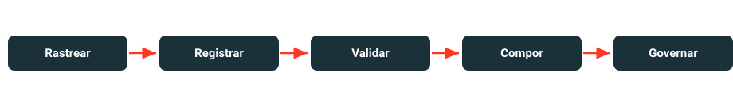

# MLOps na Databricks

Aprenda, na prática, o **ciclo de vida de modelos com MLflow** no Databricks — um
conjunto de dados, dois tipos de modelo, um ciclo de vida governado.

⏱ ~3 horas
Nível básico–intermediário
Serverless / DBR ML

Bem-vindo(a)! Você vai cobrir rastreamento de experimentos, o registro de modelos no
Unity Catalog, portões de validação, promoção por *alias* e a composição de modelos em
um pipeline governado.

Aqui a ciência de dados é o **veículo**, não o destino. O foco é o ciclo de vida — e
para deixá-lo concreto, seguimos uma empresa fictícia, a **AnyCompany**, que compra uma
matéria-prima (uma *commodity*) todos os meses.

{ width="100%" }

## A ideia central

Colocamos **dois modelos bem diferentes no mesmo ciclo de vida governado**:

1. um **forecaster** de ML tradicional (scikit-learn) que prevê o preço do próximo mês; e
2. um **otimizador** de pesquisa operacional (Pyomo) que transforma essa previsão na
   decisão de quanto comprar no mês.

!!! quote "A tese do workshop"
    **O MLflow governa o que você tiver — inclusive um modelo de pesquisa operacional
    fora do comum.** Não se trata apenas de "o MLflow suporta vários frameworks".

## O que você vai construir

Um único conjunto de dados sintético alimenta os dois modelos; ambos são registrados e
governados no Unity Catalog e, no final, compostos em uma cadeia que produz a decisão de
compra do mês:

{ width="100%" }

## A trilha do workshop

-   :material-database-cog:{ .lg } __Lab 1 — Gerar o conjunto de dados__

    ---

    Um dataset sintético, reprodutível e governado — a base de todo o ciclo de vida.

    [:octicons-arrow-right-24: Começar](lab-1-generate-data/index.md)

-   :material-chart-line:{ .lg } __Lab 2 — Forecaster (sklearn)__

    ---

    Treinar, rastrear e promover a `@champion` com um portão de validação.

    [:octicons-arrow-right-24: Abrir](lab-2-forecaster/index.md)

-   :material-cog-sync:{ .lg } __Lab 3 — Otimizador Pyomo__

    ---

    Um modelo de pesquisa operacional (sem `fit()`) governado como PyFunc — o destaque.

    [:octicons-arrow-right-24: Abrir](lab-3-optimizer/index.md)

-   :material-link-variant:{ .lg } __Lab 4 — Cadeia ponta a ponta__

    ---

    Compor os dois modelos por alias e ver o lineage no Unity Catalog.

    [:octicons-arrow-right-24: Abrir](lab-4-end-to-end/index.md)

-   :material-check-decagram:{ .lg } __Lab 5 — Verificação__

    ---

    Quatro checkpoints que provam que o caminho inteiro funcionou.

    [:octicons-arrow-right-24: Abrir](lab-5-verify/index.md)

-   :material-flask-outline:{ .lg } __Labs opcionais__

    ---

    PyTorch, Model Serving e a limpeza dos recursos.

    [:octicons-arrow-right-24: Abrir](optional/index.md)

## Para quem é

- **Público:** pessoas usuárias de Databricks em nível básico–intermediário, com pouca
  experiência em MLOps.
- **Duração:** ~3 horas.
- **Computação:** *serverless* (recomendado) ou um cluster clássico com Databricks
  Runtime ML.

!!! info "Como funcionam os labs"
    Cada página de lab corresponde a um notebook e guia você na execução. O caminho
    obrigatório são seis notebooks (`00`–`05`); os labs opcionais acrescentam uma
    variante em PyTorch, *serving* de modelo e a limpeza dos recursos.

[Começar pelos pré-requisitos :material-arrow-right:](setup/prerequisites.md){ .md-button .md-button--primary }
