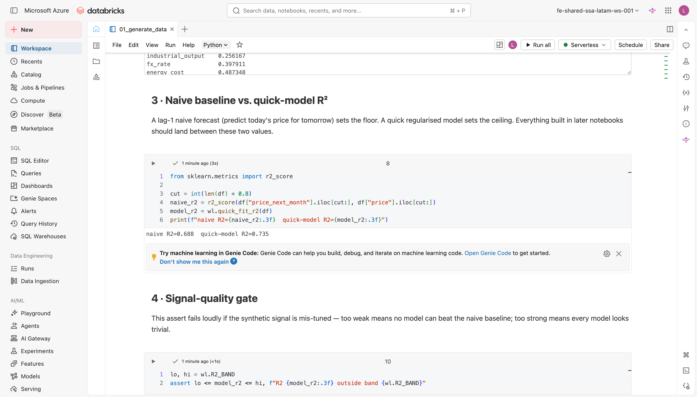

# Gerar o conjunto de dados

Todo ciclo de vida de modelos começa com dados. Não dados quaisquer: dados **reprodutíveis, governados e com uma única fonte de verdade**. Sem isso, comparar modelos diferentes é como comparar maçãs com laranjas. Você não sabe se um resultado melhor vem do modelo ou dos dados que ele usou.

Neste lab você cria o dataset sintético compartilhado que todos os outros labs consomem. Ao final, ele estará registrado como tabela Delta no Unity Catalog e como CSV em um UC Volume, disponíveis para qualquer notebook do workshop, em qualquer ordem de execução.

!!! warning "Pré-requisito"
    O `00_setup.py` precisa ter rodado antes deste notebook. Ele cria o schema e o UC Volume que este lab usa para persistir a tabela Delta e o CSV. Se o schema ainda não existir, o `saveAsTable` vai falhar com erro de caminho.

Abra `01_generate_data.py`.

---

## Por que um dataset sintético e reprodutível?

!!! note "Conceito"
    **Reprodutibilidade** significa que qualquer pessoa que execute o workshop (hoje, daqui a seis meses, em outro workspace) gera exatamente os mesmos dados, treina os mesmos modelos e obtém os mesmos resultados. Isso não é apenas conveniência pedagógica: é a base da **governança de modelos**.

    Sem reprodutibilidade, você não consegue auditar por que o modelo `v3` superou o `v2`, nem garantir que um modelo promovido a `@champion` se comportará em produção da mesma forma que se comportou na avaliação.

Um gerador determinístico com `seed` fixo garante isso. O `SEED = 42` definido em `_config.py` (e espelhado em `workshop_lib.SEED`) é passado para `generate_dataset`: o mesmo número de entrada gera a mesma sequência de números aleatórios, as mesmas features, o mesmo target e os mesmos cortes de treino/teste.

!!! tip "Curiosidade"
    O valor 42 é uma referência conhecida a *O Guia do Mochileiro das Galáxias*, de Douglas Adams, onde é a "resposta para a pergunta fundamental da vida, do universo e de tudo". Na prática, qualquer inteiro funciona. O importante é documentar e fixar o seed, não escolher o número "certo". O workshop usa 42 porque é uma tradição do ecossistema Python/ML.

---

## Passo 1 · Carregar a configuração e gerar o DataFrame bruto

Este bloco gera o dataset sintético com `wl.generate_dataset` e exibe as primeiras
linhas para conferência. A célula `%run ./_config` e o `import workshop_lib as wl`
já estão no notebook.

!!! example "Cole no notebook"
    Substitua o espaço reservado da célula **«Passo 1»** apenas pelo bloco abaixo
    (use o botão de copiar no canto do bloco).

```python
df = wl.generate_dataset(n_months=96, seed=SEED)   # 96 linhas mensais, time-ordered
display(df.head(10))
```

O `%run ./_config` (na célula anterior) centraliza todas as constantes do workspace (catálogo, esquema, caminho do Volume, seed) em um único arquivo. Você edita ali uma vez e todos os notebooks herdam a mudança. Sem copiar e colar strings entre notebooks, sem divergência silenciosa.

`generate_dataset(n_months=96, seed=SEED)` retorna um **pandas DataFrame com 96 linhas**, uma por mês (`month` de 0 a 95). As linhas **nunca são embaralhadas**: a ordem temporal é preservada deliberadamente, pois cortes de avaliação em séries temporais precisam respeitar a causalidade.

!!! note "Conceito"
    **Como o gerador funciona internamente:**

    As features de driver são construídas com **random-walks cumulativas** (`np.cumsum(rng.normal(...))`) e **sazonalidade senoidal** (`10 * np.sin(2π·t/12)`). Isso imita a dinâmica de mercados de commodities reais: tendências de médio prazo com variação estocástica mês a mês e um ciclo anual.

    O target `price_next_month` é uma **função linear ponderada dos drivers** acrescida do preço defasado (`0.3 * (price - base)`) e de ruído gaussiano calibrado. A equação é causal (os drivers do mês atual explicam o preço do mês seguinte), mas não é perfeitamente linear, o que torna o problema aprendível mas não trivial.

---

## Passo 2 · Dicionário de dados e verificações de sanidade

Estas chamadas inspecionam o dataset recém-criado: `describe()` resume a escala de
cada coluna e [`corrwith`](https://pandas.pydata.org/docs/reference/api/pandas.DataFrame.corrwith.html)
mede a correlação de cada driver com o alvo `price_next_month`.

!!! example "Cole no notebook"
    Substitua o espaço reservado da célula **«Passo 2»** pelo bloco abaixo.

```python
print(df.describe())
print("\nCorrelação dos drivers com o alvo:")
print(df[wl.DRIVERS].corrwith(df["price_next_month"]).sort_values())
```

O dataset tem **10 features de driver** que cobrem dinâmicas de demanda, custo, macro e oferta:

| Feature | Papel | Tipo de dinâmica |
|---|---|---|
| `demand_index` | Índice de demanda do mercado | Random-walk (tendência) |
| `input_cost_index` | Custo de insumos | Random-walk (tendência) |
| `fx_rate` | Taxa de câmbio | Random-walk (tendência) |
| `inventory_level` | Nível de estoque | Uniforme (nível) |
| `industrial_output` | Produção industrial | Random-walk (tendência) |
| `energy_cost` | Custo de energia | Random-walk (tendência) |
| `scrap_supply` | Oferta de sucata | Uniforme (nível) |
| `export_demand` | Demanda de exportação | Uniforme (nível) |
| `seasonality` | Componente sazonal senoidal | Cíclica (12 meses) |
| `competitor_price` | Preço do concorrente | Random-walk (tendência) |

A coluna alvo `price_next_month` é construída a partir dos mesmos drivers com pesos explícitos. As correlações são não nulas, mas não perfeitamente lineares. O sinal é **aprendível, mas não trivial**.

Além dos 10 drivers de ML, cinco colunas econômicas alimentam o modelo de otimização Pyomo nas etapas seguintes:

| Coluna | Papel no otimizador |
|---|---|
| `holding_cost` | Custo de manter estoque excedente |
| `purchase_cost` | Custo unitário de compra (≈ preço com margem) |
| `demand` | Demanda mínima a ser atendida |
| `capacity` | Capacidade máxima de compra |
| `budget` | Orçamento disponível |

---

## Passo 3 · Baseline ingênuo vs. R² do modelo rápido

Aqui você compara dois R²: o do baseline ingênuo (usar o preço de hoje como
previsão para o mês seguinte) e o de um modelo rápido de referência. O
[`r2_score`](https://scikit-learn.org/stable/modules/generated/sklearn.metrics.r2_score.html)
do scikit-learn calcula o coeficiente de determinação no conjunto de teste.

!!! example "Cole no notebook"
    Substitua o espaço reservado da célula **«Passo 3»** pelo bloco abaixo.

```python
from sklearn.metrics import r2_score

cut = int(len(df) * 0.8)
naive_r2 = r2_score(df["price_next_month"].iloc[cut:], df["price"].iloc[cut:])
model_r2 = wl.quick_fit_r2(df)   # corte temporal 80/20, GBR pequeno
print(f"naive R2={naive_r2:.3f}  quick-model R2={model_r2:.3f}")
```

<figure markdown="span">
  
  <figcaption>A saída do notebook compara o piso (baseline ingênuo lag-1) com o teto prático (modelo rápido), confirmando que o sinal é aprendível.</figcaption>
</figure>

O **forecast ingênuo lag-1** (usar o preço de hoje como previsão para o mês seguinte) define o **piso**. É o baseline mais simples possível: sem features, sem treino, sem parâmetros. Qualquer modelo que não supere esse R² não aprendeu nada útil.

`quick_fit_r2` treina um `GradientBoostingRegressor` pequeno com um **corte temporal estrito de 80/20** (os primeiros 76 meses para treino, os últimos 20 para teste) e retorna o R² no conjunto de teste. Isso define o **teto prático**: o que um modelo simples, sem tuning, consegue extrair do sinal.

!!! note "Conceito"
    **Por que um corte temporal, e não um split aleatório?**

    Em séries temporais, um split aleatório **vaza informação do futuro para o treino**: o modelo vê dados de períodos posteriores ao conjunto de teste durante o ajuste. Isso infla artificialmente o R² e não reflete o desempenho real em produção, onde o modelo nunca dispõe dos dados futuros.

    O corte temporal preserva a causalidade: treino no passado, avaliação no futuro. É o mesmo princípio que guia o backtest de estratégias financeiras.

!!! tip "Curiosidade"
    O `GradientBoostingRegressor` do scikit-learn usa árvores de decisão sequenciais em que cada árvore corrige os resíduos da anterior, daí o nome "gradient boosting". É robusto a features em escalas diferentes (sem necessidade de normalização) e frequentemente supera modelos lineares em dados tabulares com relações não lineares. Aqui ele serve apenas como referência rápida, não como o forecaster final do workshop.

---

## Passo 4 · Portão de qualidade do sinal (inline assert)

Este `assert` é o portão de qualidade do sinal: ele interrompe o notebook se o R²
do modelo rápido cair fora da banda esperada `(0.6, 0.85)`, sinalizando que o
gerador foi descalibrado antes de você seguir para os próximos labs.

!!! example "Cole no notebook"
    Substitua o espaço reservado da célula **«Passo 4»** pelo bloco abaixo.

```python
lo, hi = wl.R2_BAND    # (0.6, 0.85)
assert lo <= model_r2 <= hi, f"R2 {model_r2:.3f} outside band {wl.R2_BAND}"
```

Este `assert` é um **checkpoint de qualidade dos dados**, não um teste de modelo. Ele verifica que o gerador está calibrado corretamente para os propósitos do workshop.

A faixa `[0.6, 0.85]` foi escolhida com intenção pedagógica:

| Situação | R² | Problema |
|---|---|---|
| Sinal muito fraco | < 0,6 | Nenhum modelo supera o baseline ingênuo. O exercício de treino perde sentido |
| Sinal calibrado | 0,6 a 0,85 | Aprendível, mas não trivial: há ganho real com um modelo bem construído |
| Sinal muito forte | > 0,85 | Qualquer modelo parece ótimo. O validation gate de R² ≥ 0,6 do forecaster perde significado |

A faixa existe para que o **validation gate** do [forecaster (sklearn)](../lab-2-forecaster/index.md) (promover para `@champion` apenas se R² ≥ `R2_THRESHOLD` (0,6)) tenha significado real. Se o problema fosse trivial, o gate não filtraria nada. Se fosse impossível, o gate bloquearia tudo.

!!! tip "Curiosidade"
    Com `SEED = 42` e o runtime `databricks_ml_v5`, o `quick_fit_r2` converge para aproximadamente **0,76**, bem no centro da faixa. Esse valor foi obtido empiricamente ajustando o parâmetro de ruído em `generate_dataset`: o `noise = rng.normal(0, 12, n)` foi calibrado para que o R² do GBR pequeno ficasse próximo de 0,76, deixando espaço para um modelo mais cuidadoso (em `02_train_forecaster_sklearn.py`) melhorar e para um modelo mal ajustado ficar abaixo do threshold de 0,6.

!!! warning "Se o assert falhar"
    Uma mudança de seed, uma versão diferente do NumPy ou uma alteração no código de `generate_dataset` pode deslocar o R² para fora da faixa. Antes de investigar o código do modelo, verifique que:

    - `SEED = 42` está em `_config.py` (sem alteração)
    - O ambiente é `databricks_ml_v5` (versão 5): versões diferentes do NumPy geram sequências diferentes mesmo com o mesmo seed.
    - Você está usando `wl.quick_fit_r2(df)` sem modificações

    Se tudo estiver correto e o assert ainda falhar, o problema está nos parâmetros de ruído de `workshop_lib.generate_dataset`, não no seu código de modelo.

---

## Passo 5 · Persistir como tabela Delta + CSV em um UC Volume

Este bloco persiste o DataFrame em dois formatos: uma tabela Delta gerenciada no
Unity Catalog (via [`saveAsTable`](https://spark.apache.org/docs/latest/api/python/reference/pyspark.sql/api/pyspark.sql.DataFrameWriter.saveAsTable.html))
e um CSV em um UC Volume, deixando o dataset disponível para todos os outros labs.

!!! example "Cole no notebook"
    Substitua o espaço reservado da célula **«Passo 5»** pelo bloco abaixo.

```python
spark.createDataFrame(df).write.mode("overwrite").saveAsTable(DATA_TABLE)
df.to_csv(CSV_PATH, index=False)
print(f"Wrote {DATA_TABLE} and {CSV_PATH}.")
```

Dois formatos com propósitos complementares:

| Destino | Formato | Finalidade |
|---|---|---|
| `DATA_TABLE` | Delta no Unity Catalog | Governada, consultável via SQL, com trilha de auditoria. É a fonte canônica para todos os labs |
| `CSV_PATH` | CSV em UC Volume | Portátil; notebooks que precisam ler dados antes de ter um contexto Spark disponível usam esse arquivo diretamente |

`DATA_TABLE` e `CSV_PATH` são constantes definidas em `_config.py`. Você nunca precisa digitar o caminho manualmente, e se mudar de catálogo ou schema, basta editar `_config` uma vez.

!!! note "Conceito"
    **Delta Lake** não é apenas um formato de arquivo: é um protocolo de transações. Cada `write.mode("overwrite")` cria uma nova versão da tabela (Delta log), preservando o histórico. Você pode consultar versões anteriores com `VERSION AS OF` em SQL ou inspecionar o log com `DESCRIBE HISTORY`. É isso que torna a tabela "governada": auditável, versionada e acessível por qualquer serviço da Databricks.

!!! warning "Use Volumes, não `/dbfs/`, em compute serverless"
    Clusters serverless não montam o sistema de arquivos DBFS. Sempre escreva arquivos portáteis em um UC Volume (`/Volumes/<catalog>/<schema>/<volume>/…`). O `CSV_PATH` definido em `_config.py` já usa esse padrão. Não mude para um caminho `/dbfs/`, senão o notebook falha silenciosamente em compute serverless.

!!! tip "Curiosidade"
    O UC Volume é o equivalente moderno do DBFS para armazenamento de arquivos na Databricks. Ele tem controle de acesso via Unity Catalog (as mesmas permissões que governam tabelas e modelos), é acessível via API REST e funciona tanto em compute serverless quanto em classic clusters. O `VOLUME = "workshop_files"` foi criado pelo `00_setup.py`. Se você não executou o setup, o write vai falhar com um erro de caminho.

---

## Inspecionar a tabela escrita

=== "Python"

    ```python
    display(spark.table(DATA_TABLE))      # DATA_TABLE vem de _config
    spark.table(DATA_TABLE).count()       # deve ser 96
    ```

=== "SQL"

    ```sql
    SELECT count(*) FROM main.mlops_workshop_<seu-usuário>.commodity_monthly;
    -- Esperado: 96
    SELECT * FROM main.mlops_workshop_<seu-usuário>.commodity_monthly LIMIT 5;
    ```

---

## Uma nota sobre `trend_up`

O dataset inclui uma coluna `trend_up`, um booleano derivado de `price_next_month > price` (o preço vai subir no próximo mês?). Ela aparece no DataFrame para fins ilustrativos: é intuitiva e fácil de inspecionar visualmente.

**`trend_up` nunca é usada como feature nem como target em nenhum notebook do workshop.** O forecaster de `02_train_forecaster_sklearn.py` é um regressor que prevê o valor contínuo de `price_next_month`, não um classificador binário. Incluir `trend_up` no treino seria circular (ela é derivada do target) e pedagogicamente enganoso.

!!! tip "Curiosidade"
    A distinção regressão vs. classificação importa aqui: prever "o preço vai subir?" (classificação) parece mais fácil, mas descarta informação valiosa sobre a *magnitude* da variação. É exatamente essa magnitude que o [otimizador Pyomo](../lab-3-optimizer/index.md) precisa para calcular a decisão de compra ótima. Um modelo que só diz "sobe/desce" não é suficiente para alimentar a cadeia de decisão.

---

!!! success "Pronto quando…"
    - **96 linhas** estão na tabela Delta (consulte com `spark.table(DATA_TABLE).count()` ou o SQL acima).
    - O `assert` da célula 4 passou silenciosamente: R² impresso, sem `AssertionError`.
    - A última célula imprimiu `Wrote main.mlops_workshop_<seu-usuário>.commodity_monthly and /Volumes/…`.
    - Você consegue inspecionar a tabela no Catalog Explorer do workspace.

---

**Próximo passo:** [Treinar e registrar o forecaster](../lab-2-forecaster/index.md)
