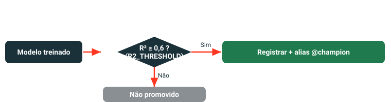

# Lab 2 — Treinar o forecaster (sklearn)

Este é o loop cotidiano de MLOps: treinar, rastrear tudo no MLflow, validar o modelo contra uma régua fixa e registrar/promover somente se ele passar — tornando a promoção uma decisão explícita, não um efeito colateral do treinamento.

Abra `02_train_forecaster_sklearn.py`.

---

## Passo 1 · Apontar o MLflow para o Unity Catalog

```python
mlflow.set_registry_uri("databricks-uc")
mlflow.set_experiment(EXPERIMENT_PATH)
```

`databricks-uc` redireciona `mlflow.register_model` do registro de workspace para o Unity Catalog Registry — o que dá governança de dados (linhagem, ACLs, auditoria) ao ciclo de vida do modelo. `EXPERIMENT_PATH` é o experimento compartilhado definido em `_config`, garantindo que os runs de todos os participantes apareçam no mesmo lugar para comparação.

---

## Passo 2 · Divisão treino/teste que respeita o tempo

```python
df = spark.table(DATA_TABLE).toPandas().sort_values("month")
cut = int(len(df) * 0.8)          # corte em 80 % — sem shuffle
train, test = df.iloc[:cut], df.iloc[cut:]
```

O dataset é ordenado por `month` e dividido cronologicamente em 80/20. **Sem shuffle.** O motivo é simples: estamos fazendo previsão de preço futuro. Se embaralhássemos as linhas antes de dividir, observações futuras poderiam vazar para o conjunto de treino — o modelo "veria o futuro" e as métricas seriam infladas de forma enganosa. O conjunto de teste é sempre as observações mais recentes.

---

## Passo 3 · Treinar e logar um run completo no MLflow

```python
with mlflow.start_run(run_name="sklearn_gbr") as run:
    model = GradientBoostingRegressor(random_state=SEED)
    model.fit(train[feats], train["price_next_month"])
    preds = model.predict(test[feats])
    rmse = float(np.sqrt(mean_squared_error(test["price_next_month"], preds)))
    mae  = float(mean_absolute_error(test["price_next_month"], preds))
    r2   = float(r2_score(test["price_next_month"], preds))
    mlflow.log_params({"model_type": "GradientBoostingRegressor", "seed": SEED})
    mlflow.log_metrics({"rmse": rmse, "mae": mae, "r2": r2})
    mlflow.sklearn.log_model(
        model, name="model",
        serialization_format="cloudpickle",
        input_example=test[feats].head(3),
        signature=mlflow.models.infer_signature(test[feats], preds),
    )
```

`feats` reúne os dez drivers econômicos (por exemplo, `demand_index`, `input_cost_index`, `fx_rate`) mais o `price` atual como feature defasada. Tudo o que é necessário para reproduzir, servir ou auditar o run — hiperparâmetros, RMSE/MAE/R², o modelo serializado, a assinatura de tipos e um exemplo de entrada concreto — é logado atomicamente dentro do bloco `with`.

`serialization_format="cloudpickle"` serializa o modelo com cloudpickle em vez do formato padrão skops. Isso mantém o artefato carregável entre diferentes versões de patch do scikit-learn e ambientes MLflow — importante num cluster de workshop compartilhado onde versões podem variar.

---

## Passo 4 · Portão de validação — registrar somente se R² ≥ `R2_THRESHOLD` (0,6)

```python
client = MlflowClient()
if r2 >= R2_THRESHOLD:                                      # 0,6
    mv = mlflow.register_model(
        f"runs:/{run.info.run_id}/model", FORECASTER_MODEL
    )
    client.set_registered_model_alias(FORECASTER_MODEL, "champion", mv.version)
    print(f"PASSED gate (r2={r2:.3f} >= {R2_THRESHOLD}). "
          f"Registered v{mv.version} as @champion.")
else:
    print(f"FAILED gate (r2={r2:.3f} < {R2_THRESHOLD}). Not promoted.")
```

`FORECASTER_MODEL` expande para `main.mlops_workshop.price_forecaster`. Se o modelo supera o limiar, ele é registrado como nova versão **e** imediatamente recebe o alias `@champion`. Se falhar, o run permanece completamente logado no experimento para inspeção — mas nenhuma versão é criada e nenhum alias se move.

{ width="100%" }

!!! info "Por que um portão determinístico de modelo único, sem champion–challenger?"
    Champion–challenger compara dois modelos com tráfego real de produção. Esse padrão exige um endpoint de serving, divisão de tráfego e um loop de feedback — três peças fora do escopo deste workshop. Um limiar determinístico é mais simples de raciocinar e suficiente para demonstrar o princípio central de MLOps: **a promoção é uma decisão, não um efeito colateral do treinamento.** O alias `@champion` é o contrato entre o pipeline de treino e cada consumidor downstream — qualquer notebook que carregue `models:/main.mlops_workshop.price_forecaster@champion` automaticamente resolve para a versão aprovada.

!!! warning "Requer `CREATE MODEL` no schema"
    Se `mlflow.register_model` falhar com erro de permissão, o seu usuário ou service principal precisa de `CREATE MODEL` em `main.mlops_workshop`. Peça ao administrador do workspace ou execute:

    ```sql
    GRANT CREATE MODEL ON SCHEMA main.mlops_workshop TO `seu-usuario@exemplo.com`;
    ```

    Se o limiar do portão não for atingido, o notebook encerra normalmente mas **nenhuma versão de modelo é criada**. O Lab 4 (o chain) carrega `@champion` — portanto você precisa passar o portão antes de avançar.

!!! success "Você deve ver…"
    - O experimento MLflow em `/Shared/mlops_workshop` contém um run chamado `sklearn_gbr` com params, métricas e um artefato de modelo logado.
    - A célula do notebook imprime `PASSED gate` e um número de versão.
    - `main.mlops_workshop.price_forecaster@champion` resolve para essa versão no Catalog Explorer.

---

## Verificar no Catalog Explorer

=== "Notebook"

    Um run bem-sucedido imprime duas linhas:

    ```
    r2=0.xxx rmse=yy.yy
    PASSED gate (r2=0.xxx >= 0.6). Registered v1 as @champion.
    ```

    Qualquer consumidor que chamar `mlflow.pyfunc.load_model("models:/main.mlops_workshop.price_forecaster@champion")` agora resolve para essa versão.

=== "Catalog Explorer"

    1. Abra **Catalog** na barra lateral esquerda.
    2. Navegue até **main → mlops_workshop → price_forecaster**.
    3. Clique na aba **Versions** — você deve ver a versão 1 com o badge do alias `champion`.
    4. A aba **Lineage** vincula de volta ao run do MLflow e à tabela de origem `commodity_monthly`.

---

!!! note "📸 Espaço reservado para captura de tela"
    *Capture aqui: o modelo `price_forecaster` registrado com o alias `@champion` no Catalog Explorer. Depois substitua por ``.*

---

**Próximo: [Lab 3 — Otimizador Pyomo](../lab-3-optimizer/index.md)**
