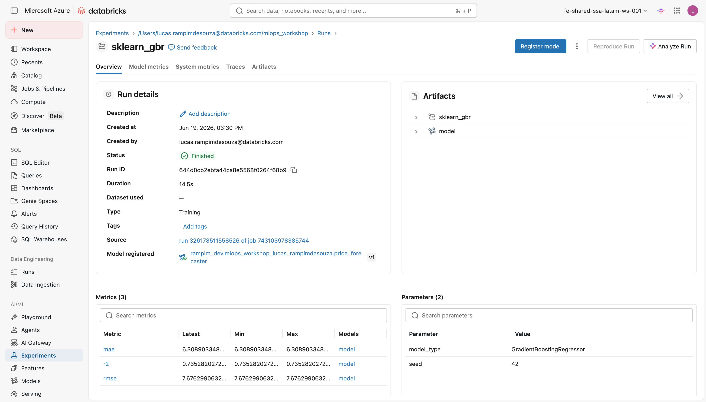

# Tracking com MLflow

Os três primeiros passos do `02_train_forecaster_sklearn.py` cobrem o bloco de
tracking: apontar o MLflow para os lugares certos, preparar os dados respeitando
o tempo, e executar o run de forma atômica. Ao final destes passos você terá um
run completo no MLflow com params, métricas e o artefato do modelo.

!!! warning "Pré-requisito"
    O dataset `commodity_monthly` precisa estar no Unity Catalog. Se você ainda
    não rodou `01_generate_data.py`, faça isso antes de continuar. O Passo 2
    carrega `spark.table(DATA_TABLE)` e falha com erro de tabela não encontrada
    se a [geração do conjunto de dados](../lab-1-generate-data/index.md) não foi executada.

---

## Passo 1 · Apontar o MLflow para o Unity Catalog

```python
mlflow.set_registry_uri("databricks-uc")
mlflow.set_experiment(EXPERIMENT_PATH)
```

!!! note "Conceito: dois endereços distintos no MLflow"
    O MLflow tem duas áreas de armazenamento que podem ser configuradas de forma
    independente:

    - **Tracking server**: onde os *runs* (experimentos) ficam, com params,
      métricas e artefatos brutos. Na Databricks, o tracking server da plataforma
      é usado automaticamente; você não precisa apontar uma URL.
    - **Model Registry**: onde as versões de modelo promovidas ficam, com aliases,
      tags e lineage. É aqui que a linha `set_registry_uri` age: por padrão o
      registry é o *Workspace Model Registry* (legado). `"databricks-uc"`
      redireciona para o **Unity Catalog Registry**, que adiciona governança de
      dados (linhagem, ACLs por schema, auditoria completa) ao ciclo de vida do
      modelo.

    `EXPERIMENT_PATH` é `f"/Users/{current_user}/mlops_workshop"`, derivado em
    `_config.py` a partir do seu usuário. Cada participante recebe um experiment
    **próprio**, dentro da sua pasta de usuário: os runs ficam isolados por pessoa,
    sem misturar execuções entre participantes, e cada um governa o seu na UI do
    MLflow.

!!! tip "Curiosidade: por que Unity Catalog e não o registry antigo?"
    O Workspace Model Registry original não tem controle de acesso por modelo:
    quem pode ver o workspace pode ver todos os modelos. Com o Unity Catalog,
    você granulariza via `GRANT` no nível de schema ou de modelo individual.
    Além disso, a lineage automática conecta o modelo à tabela de origem
    (`commodity_monthly`) e ao run de treinamento, tudo visível no Catalog
    Explorer sem configuração extra.

    Documentação oficial: [MLflow na Databricks](https://docs.databricks.com/en/mlflow/index.html).

---

## Passo 2 · Divisão treino/teste que respeita o tempo

```python
df = spark.table(DATA_TABLE).toPandas().sort_values("month")
feats = wl.DRIVERS + ["price"]
cut = int(len(df) * 0.8)          # corte em 80%, sem shuffle
train, test = df.iloc[:cut], df.iloc[cut:]
```

O dataset tem 96 meses ordenados por `month`. A divisão corta em 80%
de forma cronológica: as primeiras 77 observações viram treino, as últimas 19
viram teste.

!!! note "Conceito: por que sem shuffle em séries temporais?"
    Como vimos na [geração do conjunto de dados](../lab-1-generate-data/index.md) (baseline ingênuo), em **previsão de séries temporais**
    a ordem das observações importa muito. O modelo aprende a prever
    `price_next_month` a partir dos drivers econômicos do mês atual. Se você
    embaralhar e dividir aleatoriamente, observações futuras podem acabar no
    conjunto de treino: o modelo "vê o futuro" durante o ajuste e as métricas
    ficam artificialmente infladas.

    O held-out set deve ser sempre as observações mais **recentes**, nunca uma
    amostra aleatória. Esse padrão tem nome: *time-respecting split* ou
    *walk-forward split*.

!!! tip "Curiosidade: `feats` inclui `price` como feature defasada"
    `wl.DRIVERS` são os dez indicadores econômicos sintéticos (`demand_index`,
    `input_cost_index`, `fx_rate`, `inventory_level`, `industrial_output`,
    `energy_cost`, `scrap_supply`, `export_demand`, `seasonality`,
    `competitor_price`). A eles se soma `price`, o preço **atual** da commodity.
    Essa feature defasada captura momentum: preços de commodities tendem a
    autocorrelacionar-se no curto prazo, então o preço de hoje contém informação
    sobre o preço do próximo mês.

    Repare que a coluna `trend_up` está ausente das features. Ela é uma coluna
    derivada criada em `01_generate_data.py` apenas para **ilustração visual**;
    usá-la seria data leakage direto, porque você calcularia a tendência futura
    a partir do alvo.

---

## Passo 3 · Treinar e logar um run completo no MLflow

```python
with mlflow.start_run(run_name="sklearn_gbr") as run:
    model = GradientBoostingRegressor(random_state=SEED)
    model.fit(train[feats], train["price_next_month"])
    preds = model.predict(test[feats])

    rmse = float(np.sqrt(mean_squared_error(test["price_next_month"], preds)))
    mae  = float(mean_absolute_error(test["price_next_month"], preds))
    r2   = float(r2_score(test["price_next_month"], preds))

    mlflow.log_params({"model_type": "GradientBoostingRegressor", "seed": SEED})
    mlflow.log_metrics({"rmse": rmse, "mae": mae, "r2": r2})

    mlflow.sklearn.log_model(
        model, name="model",
        serialization_format="cloudpickle",
        input_example=test[feats].head(3),
        signature=mlflow.models.infer_signature(test[feats], preds),
    )
    print(f"r2={r2:.3f} rmse={rmse:.2f}")
```

!!! note "Conceito: o que é um MLflow *run*?"
    Um *run* é a unidade atômica de rastreamento no MLflow. Dentro do bloco
    `with mlflow.start_run(...) as run:`, tudo o que você logar fica associado a
    esse run: hiperparâmetros (`log_params`), métricas de avaliação
    (`log_metrics`) e o artefato do modelo (`log_model`). Se o notebook abortar
    no meio do caminho, o run fica marcado como `FAILED`: você não corre o risco
    de ter métricas sem modelo ou vice-versa.

    O `run_name="sklearn_gbr"` é apenas um rótulo legível. O identificador real
    é `run.info.run_id`, um UUID gerado pelo servidor que usaremos no Passo 4
    para registrar o modelo.

!!! note "Conceito: `mlflow.sklearn.log_model` na API MLflow 3.x"
    Na API do MLflow 3.x, o parâmetro correto é `name=`, **não**
    `artifact_path=` (que pertence à API 2.x e está deprecado). `name="model"`
    define o sub-caminho dentro do artefato do run onde o modelo é salvo.

    Os outros parâmetros importantes:

    - **`serialization_format="cloudpickle"`**: o formato padrão para modelos
      sklearn no MLflow 3.x é o `skops`, mais seguro contra desserialização
      arbitrária, mas exige compatibilidade exata de versão do scikit-learn.
      `cloudpickle` é mais portável entre versões de patch, o que é importante
      num ambiente de workshop onde versões do runtime podem variar ligeiramente
      entre participantes.
    - **`input_example=test[feats].head(3)`**: um exemplo concreto de entrada
      (3 linhas do conjunto de teste). O MLflow usa esse exemplo para inferir a
      assinatura automaticamente e para popular a UI de inferência em Model
      Serving. Sem ele, o endpoint de serving fica sem documentação.
    - **`signature=mlflow.models.infer_signature(test[feats], preds)`**: a
      *signature* registra os tipos e shapes esperados de entrada e saída. Ela é
      o contrato formal do modelo: qualquer chamada com tipos errados falha cedo,
      antes de chegar ao `predict`.

!!! tip "Curiosidade: por que `GradientBoostingRegressor` e não XGBoost?"
    GBR do scikit-learn é a escolha deliberada de **minimalismo didático**: está
    disponível em qualquer ambiente Python sem instalação extra, tem
    `random_state` para reprodutibilidade e performa bem no dataset sintético
    (R² esperado em torno de 0,75, dentro da banda [0,6 a 0,85]). O objetivo do
    workshop não é encontrar o melhor modelo; é mostrar o lifecycle do MLflow.
    Um XGBoost ou LightGBM teria exatamente os mesmos passos de tracking e
    registro.

!!! tip "Curiosidade: as três métricas de regressão logadas"
    O notebook loga RMSE, MAE e R²:

    - **RMSE** (Root Mean Squared Error): penaliza erros grandes
      desproporcionalmente. Útil quando erros grandes são especialmente custosos,
      como prever preço muito abaixo do real levando a compras insuficientes.
    - **MAE** (Mean Absolute Error): a média dos erros absolutos. Mais intuitiva
      ("erro médio de X por unidade") e menos sensível a outliers.
    - **R²** (coeficiente de determinação): fração da variância do alvo explicada
      pelo modelo. 0 = não melhor que a média; 1 = perfeito. É a métrica do
      **validation gate**, detalhado na próxima página.

    Os três ficam logados no MLflow e aparecem na UI do experiment para
    comparação entre runs.

<figure markdown="span">
  
  <figcaption>O run <code>sklearn_gbr</code> no MLflow: as três métricas (rmse, mae, r2), os parâmetros e os artefatos do modelo.</figcaption>
</figure>

---

!!! success "Pronto quando..."
    - O experiment MLflow em `/Users/<seu-usuário>/mlops_workshop` contém um run chamado
      `sklearn_gbr` com params, métricas e um artefato de modelo logado.
    - A célula do notebook imprime uma linha como `r2=0.xxx rmse=yy.yy`.
    - Você consegue ver o run na UI do MLflow (clique em **Experiments** na
      barra lateral do workspace).

---

**Próximo passo:** [Validation gate e registro](validation-gate.md)
