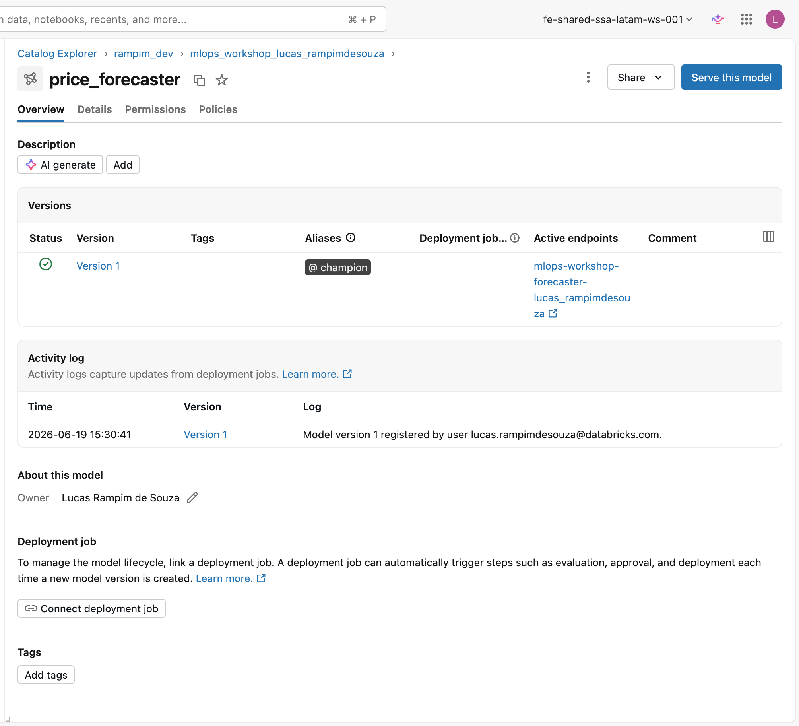

# Validation gate e registro

O Passo 4 é onde a decisão acontece. O run está completo, as métricas estão
logadas, e agora o notebook pergunta: este modelo é bom o suficiente para virar
um modelo governado no Unity Catalog? A resposta vem de um critério objetivo,
não de uma inspeção manual.

---

## Passo 4 · Validation gate: registrar somente se R² >= R2_THRESHOLD

```python
client = MlflowClient()
if r2 >= R2_THRESHOLD:                                      # 0,6
    mv = mlflow.register_model(
        f"runs:/{run.info.run_id}/model", FORECASTER_MODEL
    )
    client.set_registered_model_alias(FORECASTER_MODEL, "champion", mv.version)
    print(f"PASSED gate (r2={r2:.3f} >= {R2_THRESHOLD}). "
          f"Registered v{mv.version} as @champion.")
else:
    print(f"FAILED gate (r2={r2:.3f} < {R2_THRESHOLD}). Not promoted.")
```

`FORECASTER_MODEL` expande para `main.mlops_workshop_<seu-usuário>.price_forecaster`
(definido em `_config.py` como `f"{CATALOG}.{SCHEMA}.price_forecaster"`).

!!! note "Conceito: o que é um validation gate?"
    Um **validation gate** é uma condição explícita e mensurável que um modelo
    precisa satisfazer *antes* de ser promovido para uso downstream. Aqui a
    condição é simples: R² no held-out test maior ou igual a 0,6 (constante
    `R2_THRESHOLD`, definida em `_config.py`).

    Se o modelo passa:

    1. `mlflow.register_model(...)` cria uma **nova versão** no Unity Catalog
       Registry, copiando o artefato do run para armazenamento versionado.
    2. `set_registered_model_alias(FORECASTER_MODEL, "champion", mv.version)`
       move o alias `@champion` para apontar para essa versão.

    Se o modelo falha: o run existe normalmente no experiment (você pode
    inspecionar os parâmetros e métricas para entender por que falhou), mas
    **nenhuma versão de modelo é criada** e nenhum alias se move. O alias
    `@champion` permanece apontando para a última versão aprovada, ou
    simplesmente não existe se nenhuma versão foi aprovada ainda.

!!! note "Conceito: por que um gate determinístico de modelo único, sem champion-challenger?"
    O padrão **champion-challenger** compara dois modelos com tráfego real de
    produção: o champion recebe, digamos, 90% das requisições; o challenger
    recebe 10%. Depois de coletar métricas de negócio suficientes, você decide
    qual fica. Esse padrão é poderoso, mas exige um endpoint de serving com
    suporte a divisão de tráfego, um pipeline de coleta de feedback e critérios
    de promoção baseados em métricas de negócio. São três peças fora do escopo
    deste workshop.

    Um limiar determinístico é mais simples de raciocinar e suficiente para
    demonstrar o **princípio central**: promoção é uma decisão, não um efeito
    colateral do treinamento. Enquanto você não decide promover, o alias
    `@champion` não muda e consumidores downstream continuam usando a versão
    anterior sem interrupção.

!!! note "Conceito: aliases como contrato estável entre producer e consumers"
    No Unity Catalog Registry, cada versão de modelo tem um número inteiro
    (1, 2, 3...) que cresce a cada novo registro. Re-rodar este notebook cria a
    versão 2; rodar de novo cria a versão 3. Se `04_end_to_end.py` ou `05_verify.py`
    referenciassem `models:/main.mlops_workshop_<seu-usuário>.price_forecaster/1`, eles
    quebrariam silenciosamente assim que uma nova versão melhor fosse promovida.

    A solução é o **alias**: um rótulo nomeado que pode ser movido de versão
    para versão sem alterar o código consumidor. `@champion` é o alias padrão
    deste workshop, o contrato entre o pipeline de treino e todo downstream.
    Qualquer código que carregar
    `models:/main.mlops_workshop_<seu-usuário>.price_forecaster@champion` resolve
    automaticamente para a versão aprovada mais recente, hoje e amanhã, sem
    editar nada.

    É o mesmo princípio de um DNS: você não decorou o IP do Google. Você usa
    `google.com` e o DNS resolve. O alias é o DNS do modelo.

!!! tip "Curiosidade: versões nunca são deletadas, só aliases se movem"
    Uma vez que uma versão é criada no registry, ela fica lá. Você pode arquivar
    ou deletar versões velhas manualmente, mas o fluxo padrão é apenas mover o
    alias. Isso garante rastreabilidade completa: é sempre possível saber qual
    versão estava em `@champion` em qualquer momento no passado (via histórico
    de aliases na UI ou via `MlflowClient`).

!!! warning "Requer `CREATE MODEL` no schema"
    Se `mlflow.register_model` falhar com erro de permissão, o seu usuário ou
    service principal precisa da permissão `CREATE MODEL` no schema
    `mlops_workshop_<seu-usuário>`. Peça ao administrador do workspace ou execute:

    ```sql
    GRANT CREATE MODEL ON SCHEMA main.mlops_workshop_<seu-usuário> TO `seu-usuario@exemplo.com`;
    ```

    Se o limiar do gate não for atingido, o notebook encerra normalmente mas
    **nenhuma versão é criada**. O `04_end_to_end.py` carrega `@champion` e falha com uma
    mensagem clara se o alias não existir:
    *"no @champion: run 02_train_forecaster_sklearn and confirm it passed
    the R²>=0.6 gate"*. Você precisa passar o gate antes de avançar.

---

## Verificar no Catalog Explorer

Após o notebook imprimir `PASSED gate`, confirme o resultado na interface:

=== "Saída do notebook"

    Um run bem-sucedido imprime duas linhas:

    ```
    r2=0.xxx rmse=yy.yy
    PASSED gate (r2=0.xxx >= 0.6). Registered v1 as @champion.
    ```

    A partir deste momento, qualquer código que chamar:

    ```python
    mlflow.pyfunc.load_model("models:/main.mlops_workshop_<seu-usuário>.price_forecaster@champion")
    ```

    resolve para essa versão, sem precisar saber o número `v1`.

=== "Catalog Explorer"

    1. Abra **Catalog** na barra lateral esquerda.
    2. Navegue até **main → mlops_workshop_&lt;seu-usuário&gt; → price_forecaster**.
    3. Clique na aba **Versions**. Você deve ver a versão 1 com o badge do
       alias `champion`.
    4. A aba **Lineage** vincula de volta ao run do MLflow e à tabela de origem
       `commodity_monthly`.

<figure markdown="span">
  
  <figcaption>O <code>price_forecaster</code> no Unity Catalog: a versão 1 marcada com o alias <code>@champion</code> e o log de atividade do registro.</figcaption>
</figure>

---

!!! success "Pronto quando..."
    - O experiment MLflow em `/Users/<seu-usuário>/mlops_workshop` contém um run `sklearn_gbr`
      com params, métricas e artefato de modelo logados.
    - A célula do notebook imprimiu `PASSED gate` com um número de versão.
    - `main.mlops_workshop_<seu-usuário>.price_forecaster@champion` resolve para essa versão
      no Catalog Explorer (aba Versions mostra o badge `champion`).

---

O `price_forecaster@champion` que você acabou de criar é o primeiro elo da
cadeia. Em seguida, você vai registrar o [otimizador Pyomo](../lab-3-optimizer/index.md), um modelo de pesquisa
operacional sem treinamento tradicional, usando o mesmo lifecycle do MLflow com
um [PyFunc customizado](../conceitos/pyfunc-modelos-customizados.md).
No [workflow end-to-end](../lab-4-end-to-end/index.md), os dois modelos são carregados via `@champion` e compostos em uma
decisão de compra completa.

**Próximo passo:** [Otimizador Pyomo](../lab-3-optimizer/index.md)
