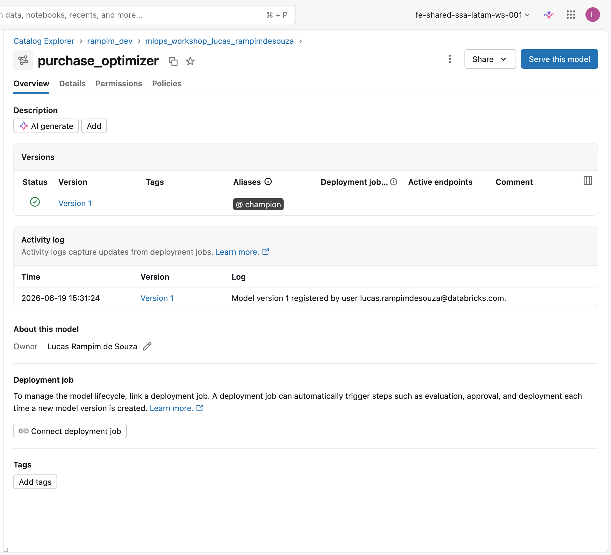

# Registrar e promover a `@champion`

Com o wrapper PyFunc validado na página anterior, o próximo passo é registrar o otimizador no Unity Catalog, promovê-lo para `@champion` e confirmar que tudo funciona carregando o modelo pelo alias. Esta página cobre os passos finais de `03_register_optimizer_pyomo.py`.

---

## O assert de viabilidade: a porta de entrada do registro

Um modelo sklearn tem métricas de treino (R², RMSE) que servem como critério de qualidade antes do registro. O otimizador Pyomo não tem nenhuma dessas métricas, por isso o notebook exige um **assert de viabilidade** como gate explícito:

!!! example "Cole no notebook"
    Substitua o espaço reservado da célula **«O assert de viabilidade»** pelo bloco abaixo.

```python
row = sample_out.iloc[0]

assert row["status"] == "optimal", \
    f"optimizer infeasible on example: {row.to_dict()}"

assert 100.0 - 1e-6 <= row["purchase_qty"] <= 200.0 + 1e-6, \
    f"qty out of bounds: {row['purchase_qty']}"
```

O que cada assert verifica:

| Assert                          | O que protege                                                                    |
|---------------------------------|----------------------------------------------------------------------------------|
| `status == "optimal"`           | Solver chegou a uma solução: ambiente correto e restrições consistentes         |
| `purchase_qty` dentro dos limites | Solução respeita `[demand, capacity]`: formulação matematicamente correta   |

!!! warning "Atenção"
    Se qualquer assert falhar, o notebook para **aqui**, antes do `log_model`. Isso é intencional: é muito melhor descobrir que o solver está ausente ou que as restrições estão mal especificadas *antes* de registrar um modelo quebrado no Unity Catalog. Um modelo registrado com `status="infeasible"` é tecnicamente aceito pelo MLflow, mas inútil para qualquer chamada subsequente.

---

## Fazer o log do modelo com `code_paths`

!!! example "Cole no notebook (parte 1 de 2)"
    Esta célula combina **dois blocos**. Cole primeiro o log abaixo no espaço
    reservado da célula; o bloco «Definir o alias `@champion`» vem logo em seguida,
    na mesma célula.

```python
signature = mlflow.models.infer_signature(example, sample_out)
client = MlflowClient()

with mlflow.start_run(run_name="pyomo_optimizer"):
    info = mlflow.pyfunc.log_model(
        name="model",
        python_model=wl.PurchaseOptimizerModel(),
        code_paths=["./workshop_lib.py"],
        pip_requirements=["pyomo>=6.7", "highspy>=1.7", "pandas>=2.0"],
        input_example=example,
        signature=signature,
        registered_model_name=OPTIMIZER_MODEL,
    )
```

### Parâmetros que merecem atenção especial

**`name="model"`**: MLflow 3.x usa `name=` (não o antigo `artifact_path=`). O artefato do modelo fica em `<run_uri>/model` dentro do experimento.

**`python_model=wl.PurchaseOptimizerModel()`**: a instância do wrapper PyFunc. O MLflow vai serializar esse objeto (pickle) e empacotá-lo junto com tudo o que é necessário para recarregá-lo.

**`code_paths=["./workshop_lib.py"]`**: este é o parâmetro mais importante. Sem ele, `solve_purchase` estaria ausente no momento do carregamento (o artefato não saberia de onde importar `workshop_lib`). Com ele, o MLflow copia `workshop_lib.py` para dentro do artefato do modelo. O arquivo *viaja junto* e fica disponível em qualquer ambiente de serving ou inferência.

**Como `code_paths` funciona internamente:** o MLflow copia cada arquivo listado para uma subpasta `code/` dentro do artefato do modelo. Quando o modelo é carregado, essa pasta é adicionada ao `sys.path` automaticamente. Assim, qualquer `import workshop_lib` dentro de `PurchaseOptimizerModel.predict` resolve corretamente, seja em um cluster diferente, em um endpoint de serving ou meses depois.

**`pip_requirements`**: declara as dependências explicitamente para o ambiente de serving. O MLflow usa essa lista para criar o ambiente virtual quando o modelo é servido via Model Serving ou carregado com `mlflow.pyfunc.load_model`. Note que `pyomo` e `highspy` também estão declarados no cabeçalho PEP 723 do notebook (para o ambiente de execução); aqui eles aparecem novamente para o ambiente de inferência.

**`registered_model_name=OPTIMIZER_MODEL`**: registra o modelo diretamente no Unity Catalog em uma única chamada. `OPTIMIZER_MODEL` é definido em `_config.py` como `f"{CATALOG}.{SCHEMA}.purchase_optimizer"`, sem nenhum nome hardcoded no notebook.

**Para que serve a signature?** `mlflow.models.infer_signature(example, sample_out)` inspeciona os DataFrames de entrada e saída e gera um schema tipado. Isso permite que o Model Serving valide entradas sem executar o modelo e fornece ao Unity Catalog metadados ricos sobre o contrato de entrada/saída do modelo, visíveis na UI e nas consultas ao catálogo.

!!! warning "Atenção"
    **`mlflow.set_registry_uri("databricks-uc")` deve ser chamado antes de qualquer operação de registry.** Essa chamada é feita no início do notebook (junto com os demais imports) e instrui o MLflow a usar o Unity Catalog como registry, em vez do registry legado. Sem ela, `registered_model_name` com o formato `catalog.schema.model` vai falhar.

---

## Definir o alias `@champion`

!!! example "Cole no notebook (parte 2 de 2)"
    Cole este bloco **logo após o `log_model`**, na mesma célula.

```python
client.set_registered_model_alias(
    OPTIMIZER_MODEL, "champion", info.registered_model_version
)
```

`info.registered_model_version` é o número de versão que o MLflow atribuiu neste registro. Usamos essa variável *agora*, para definir o alias, e depois nunca mais: todo o restante do workshop usa `@champion`, nunca um inteiro fixo.

**Por que alias em vez de versão?** Cada execução do `03_register_optimizer_pyomo.py` registra uma nova versão do modelo (1, 2, 3…). Se o `04_end_to_end.py` dependesse de `models:/.../1`, a segunda execução do workshop quebraria silenciosamente, carregando a versão errada. Com `@champion`, o `04_end_to_end.py` sempre carrega *a versão promovida*, independentemente de quantas vezes o workshop foi reexecutado. É o mesmo padrão do forecaster em `02_train_forecaster_sklearn.py`, garantindo consistência entre os dois modelos.

---

## Carregar pelo alias e confirmar

!!! example "Cole no notebook"
    Substitua o espaço reservado da célula **«Carregar pelo alias e confirmar»** pelo bloco abaixo.

```python
opt = mlflow.pyfunc.load_model(f"models:/{OPTIMIZER_MODEL}@champion")
print(opt.predict(example))
```

Essa é a prova final: o modelo foi registrado, o alias foi definido e agora ele é carregado *pelo alias*, exatamente como o `04_end_to_end.py` fará, em um notebook diferente e potencialmente em um cluster diferente. Se `opt.predict(example)` retornar um DataFrame com `status=optimal`, o ciclo de vida está completo.

<figure markdown="span">
  
  <figcaption>O otimizador Pyomo empacotado como PyFunc, registrado no Unity Catalog como <code>purchase_optimizer</code> v1 com o alias <code>@champion</code>, governado exatamente como o forecaster.</figcaption>
</figure>

!!! success "Pronto quando..."
    - O assert de viabilidade conclui **sem erro** (solver presente e funcional).
    - O Unity Catalog exibe o modelo `purchase_optimizer` (nome derivado de `OPTIMIZER_MODEL`) com a versão 1 marcada com o alias `@champion`.
    - A chamada `opt.predict(example)` retorna um DataFrame com `purchase_qty=100.0` e `status=optimal`.
    - O MLflow Tracking mostra o run `pyomo_optimizer` no experimento compartilhado do workshop, com `input_example`, `signature`, e o artefato `model/` contendo `workshop_lib.py` na subpasta `code/`.

---

**Próximo passo:** [Workflow end-to-end](../lab-4-end-to-end/index.md)
