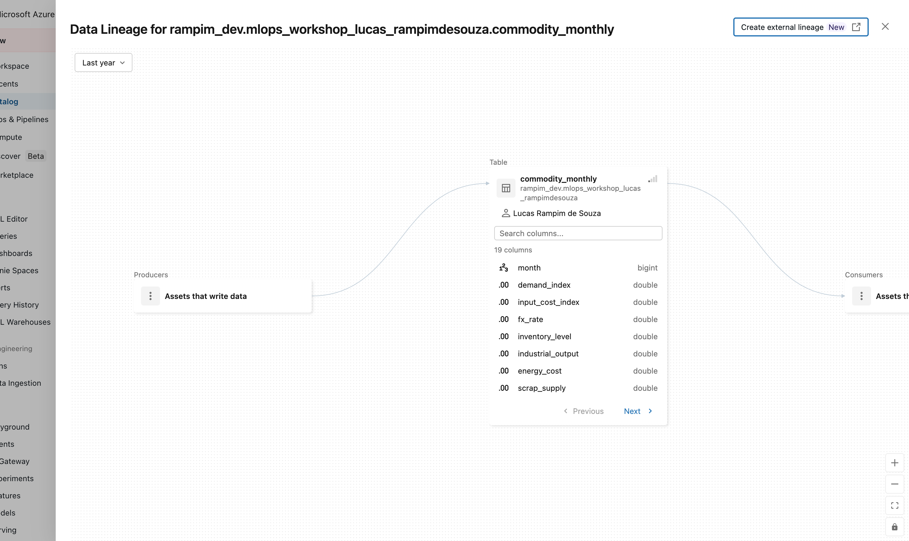

# Rodar a cadeia e obter a decisão

Com os dois modelos carregados por `@champion` na página anterior, a última etapa é executar a cadeia de decisão: dados do mês mais recente entram, uma decisão de compra sai. Esse fluxo, que antes era uma rotina manual, agora conta com inputs rastreados, modelos versionados e lineage auditável no Unity Catalog.

---

## A cadeia em quatro passos

```
drivers do mês atual
        │
        ▼
forecaster @champion  ──→  preço previsto
                                  │
                                  ▼
                       optimizer @champion  ──→  decisão de compra
```

O código que implementa isso em `04_end_to_end.py`:

```python
predicted_price = float(forecaster.predict(latest[wl.DRIVERS + ["price"]])[0])

opt_input = latest[wl.ECON_COLS].copy()
opt_input.insert(0, "predicted_price", predicted_price)

decision = optimizer.predict(opt_input)

print(f"Predicted next-month price: {predicted_price:.2f}")
print(decision)
```

### Passo 1: Forecaster prevê o preço

```python
predicted_price = float(forecaster.predict(latest[wl.DRIVERS + ["price"]])[0])
```

`latest` é um DataFrame de uma linha: o registro mais recente da tabela `commodity_monthly`. O forecaster recebe os drivers econômicos (`wl.DRIVERS`) mais a coluna `price` (preço histórico) e retorna a estimativa do preço do próximo mês.

O resultado é extraído como `float`, pois o optimizer recebe um escalar, não um array.

!!! note "Conceito"
    `wl.DRIVERS` é a lista de colunas de entrada do forecaster, definida em `workshop_lib.py`. O modelo sklearn treinado em `02_train_forecaster_sklearn.py` aprendeu a relação entre esses drivers e o preço futuro. Aqui você usa esse aprendizado para projetar o próximo mês com os dados já disponíveis.

### Passo 2: Construir o input do optimizer

```python
opt_input = latest[wl.ECON_COLS].copy()
opt_input.insert(0, "predicted_price", predicted_price)
```

O optimizer precisa de um DataFrame com o preço previsto e as variáveis econômicas (`wl.ECON_COLS`: capacidade de estoque, demanda, budget, etc.). O preço previsto é inserido como a primeira coluna, seguindo o contrato de interface definido em `workshop_lib.PurchaseOptimizerModel`.

### Passo 3: Optimizer decide a compra

```python
decision = optimizer.predict(opt_input)
```

O `optimizer` (modelo Pyomo embrulhado como PyFunc) recebe o input, monta o problema de otimização e o resolve com o solver HiGHS. O resultado é um DataFrame com a quantidade de compra recomendada e o status da solução.

!!! note "Conceito"
    O optimizer resolve: minimizar o custo total (preço × quantidade comprada + custo de estoque excedente), sujeito a restrições de demanda mínima, capacidade máxima de estoque e orçamento. O solver **HiGHS** (`appsi_highs`) resolve isso em milissegundos; é um solver de programação linear de código aberto, instalado via `highspy` sem dependências de sistema. Quando a solução é `status=optimal`, o optimizer encontrou o mínimo global para aquele conjunto de restrições.

---

## O que você deve ver

```
Predicted next-month price: 142.37
   purchase_qty  status
0         850.0  optimal
```

!!! success "Pronto quando…"
    - Uma linha impressa com o preço previsto no formato `Predicted next-month price: XXX.XX`
    - Um DataFrame de uma linha com `purchase_qty` e `status=optimal`
    - Nenhum erro de registry (ambos os `@champion` foram encontrados)

Se o status for `infeasible`, as restrições do problema (demanda, capacidade, orçamento) não têm solução conjunta para os parâmetros do mês simulado. Verifique os valores de `wl.ECON_COLS` no registro mais recente.

---

## Lineage no Unity Catalog

A cadeia que você acabou de executar deixa um rastro automático no Unity Catalog. Para visualizá-lo:

1. Abra o **Catalog Explorer** na Databricks.
2. Navegue até a tabela referenciada por `DATA_TABLE` (por padrão, `main.mlops_workshop_<seu-usuário>.commodity_monthly`).
3. Clique na aba **Lineage**.

Você verá um grafo conectando:

```
tabela Delta (commodity_monthly)
        │
        ▼
experimento MLflow (/Users/<seu-usuário>/mlops_workshop)
        │
        ├──→ main.mlops_workshop_<seu-usuário>.price_forecaster
        │
        └──→ main.mlops_workshop_<seu-usuário>.purchase_optimizer
```

!!! note "Conceito"
    Esse grafo é construído automaticamente pelo Unity Catalog quando o `registry_uri` está apontado para `databricks-uc` e os modelos foram registrados via MLflow com a tabela Delta como fonte de dados. Nenhuma instrumentação adicional é necessária. O UC captura a linhagem a partir dos metadados do experimento MLflow, e qualquer pessoa com acesso ao Catalog Explorer consegue responder "qual versão do modelo gerou esta decisão de compra?" sem abrir nenhum log.

!!! tip "Curiosidade"
    O lineage do Unity Catalog vai além de modelos: ele também rastreia transformações entre tabelas Delta (quais tabelas foram lidas para criar outra). Quando seu pipeline de ML lê uma feature table, a transforma, grava outra tabela e depois usa essa tabela para treinar um modelo, o UC conecta toda essa cadeia em um único grafo navegável. É a diferença entre "saber que o modelo existe" e "saber de onde veio cada dado que o gerou".

<figure markdown="span">
  
  <figcaption>O grafo de lineage do Unity Catalog para a <code>commodity_monthly</code>: os produtores (quem escreve a tabela) à esquerda e os consumidores (quem a lê) à direita, com as colunas da tabela no nó central.</figcaption>
</figure>

---

**Próximo passo:** [Verificação](../lab-5-verify/index.md)
