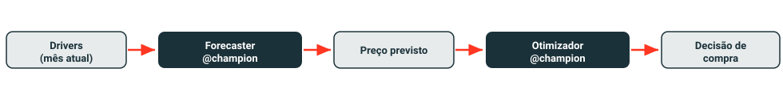

# Lab 4 — Cadeia ponta a ponta

Neste lab você vai compor os dois modelos já registrados em um único pipeline governado: uma rotina mensal que antes era executada manualmente agora vive em um ciclo de vida rastreado, com lineage auditável do dado ao modelo.

{ width="100%" }

Abra `04_end_to_end.py` no repositório.

---

## 1 · Imports e configuração do registry

```python
import mlflow
import pandas as pd
import workshop_lib as wl
from mlflow import MlflowClient

mlflow.set_registry_uri("databricks-uc")
client = MlflowClient()
```

`set_registry_uri("databricks-uc")` redireciona o MLflow para o Unity Catalog como backend do model registry. Sem isso, aliases como `@champion` não resolveriam contra os modelos registrados no UC — o cliente tentaria o registry legado do workspace e falharia silenciosamente.

---

## 2 · Champion guard

```python
try:
    client.get_model_version_by_alias(FORECASTER_MODEL, "champion")
except Exception:
    raise RuntimeError(
        f"No @champion alias on {FORECASTER_MODEL}. Run 02_train_forecaster_sklearn "
        f"and confirm it passed the R2>={R2_THRESHOLD} gate before running this notebook."
    )
```

Antes de tocar nos dados, o notebook verifica proativamente se o alias `@champion` existe. O motivo: se o Lab 2 não tiver sido executado (ou o modelo não tiver passado pelo gate de R²), o erro que viria do registry seria genérico e difícil de diagnosticar. A guarda falha imediatamente com uma mensagem clara e acionável — você sabe exatamente o que falta fazer, em vez de ter que interpretar um stack trace do registry.

!!! warning "Pré-requisitos obrigatórios"
    Execute o **Lab 2** (`02_train_forecaster_sklearn`) e o **Lab 3** (`03_purchase_optimizer`) antes deste. Ambos precisam ter promovido um `@champion` no Unity Catalog. Se a guarda disparar, volte ao lab correspondente e confirme que o modelo passou pelo gate de qualidade.

---

## 3 · Carregar os dois modelos por alias

```python
df = spark.table(DATA_TABLE).toPandas().sort_values("month")
latest = df.iloc[[-1]]

forecaster = mlflow.pyfunc.load_model(f"models:/{FORECASTER_MODEL}@champion")
optimizer  = mlflow.pyfunc.load_model(f"models:/{OPTIMIZER_MODEL}@champion")
```

Ambos os modelos — `price_forecaster@champion` e `purchase_optimizer@champion` — são carregados pelo alias, nunca pelo número de versão.

!!! info "Por que alias e não número de versão?"
    Cada novo treino registra uma versão nova (v1, v2, v3…). Se o código usasse um número fixo, seria necessário atualizar o notebook a cada retreino. Com `@champion`, o alias aponta sempre para a versão promovida mais recente: o notebook não precisa mudar — apenas o alias é atualizado no registry quando um modelo melhor é promovido.

---

## 4 · Rodar a cadeia: drivers → preço previsto → decisão

=== "Rodar a cadeia"

    ```python
    predicted_price = float(forecaster.predict(latest[wl.DRIVERS + ["price"]])[0])

    opt_input = latest[wl.ECON_COLS].copy()
    opt_input.insert(0, "predicted_price", predicted_price)

    decision = optimizer.predict(opt_input)

    print(f"Predicted next-month price: {predicted_price:.2f}")
    print(decision)
    ```

    O fluxo é direto: o `forecaster` recebe os drivers econômicos do mês mais recente e estima o preço do próximo mês. Esse preço previsto é inserido como feature adicional para o `optimizer` (modelo Pyomo), que resolve o problema de otimização e retorna a quantidade de compra recomendada com `status=optimal`.

=== "Inspecionar o lineage"

    Abra o **Catalog Explorer** no workspace Databricks:

    1. Navegue até a tabela Delta referenciada por `DATA_TABLE` (definida no `_config`)
    2. Clique na aba **Lineage**
    3. Você verá o grafo: **tabela Delta → experimento MLflow → modelos registrados**

    Esse grafo conecta automaticamente o dado de origem aos modelos que o consumiram — sem nenhuma instrumentação manual adicional. É o Unity Catalog fazendo governança de ponta a ponta: qualquer pessoa pode responder "qual versão do modelo gerou esta decisão de compra?" sem abrir nenhum log.

!!! success "Você deve ver"
    - Uma linha impressa com o preço previsto, por exemplo: `Predicted next-month price: 142.37`
    - Um DataFrame de uma linha com a decisão de compra e `status=optimal`
    - No Catalog Explorer → Lineage: um grafo conectando a tabela Delta de entrada → runs do experimento → ambos os modelos registrados

!!! note "📸 Espaço reservado para captura de tela"
    *Capture aqui: o grafo de lineage no Catalog Explorer (tabela → experimento → modelos). Depois substitua por ``.*

---

Próximo: [Lab 5 — Verificação](../lab-5-verify/index.md)
