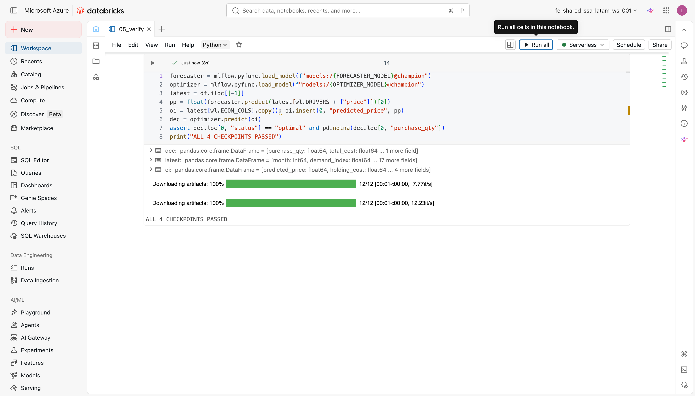

# Verificação (Definition of Done)

`05_verify.py` é o portão final do caminho obrigatório: quatro asserções baseadas em alias que provam, de ponta a ponta, que os dois modelos estão registrados, promovidos e operando juntos em cadeia. Se todos os quatro passarem, o workshop está concluído.

---

## Antes de começar

!!! warning "Pré-requisito"
    Execute os notebooks `00` a `04` na ordem antes de abrir este lab.  
    O `05_verify.py` **não cria nenhum recurso**: ele apenas valida o que os notebooks anteriores produziram. Se qualquer checkpoint falhar, a seção [Passou × Falhou](#referencia-rapida-passou-x-falhou) indica qual notebook reexecutar.

Abra `05_verify.py`.

---

## A filosofia: verificação inline, não pytest

!!! note "Conceito"
    **Verificação inline** significa colocar asserções diretamente nas células do notebook, logo após o código que elas validam. A execução para imediatamente no primeiro `assert` que falha, com uma mensagem clara indicando qual checkpoint não passou, sem precisar abrir um terminal separado ou interpretar um relatório de testes.

Projetos de software de longa duração geralmente têm uma suíte `pytest` separada: centenas de testes unitários, fixtures de banco de dados, mocks de APIs externas. Essa é a abordagem correta para código de produção que será mantido por anos.

Um workshop tem requisitos diferentes:

| Critério | Suíte pytest separada | Verificação inline |
|---|---|---|
| Overhead de setup | Alto (conftest, fixtures, mocks) | Nenhum |
| Feedback durante o live demo | Lento (é preciso sair do notebook) | Imediato, célula a célula |
| Audiência-alvo | Engenheiros de software | Data scientists / ML practitioners |
| Objetivo | Regressão contínua em CI | Confirmar que o workshop rodou corretamente |
| Adequação para este workshop | Excessivo | Adequada |

!!! tip "Curiosidade"
    A maior armadilha dos testes inline em notebooks é a **ordem de execução das células**: se você reexecutar uma célula fora de ordem, o estado do kernel pode ser inconsistente. O `05_verify.py` contorna isso sendo um notebook de verificação isolado. Ele carrega tudo do zero (MlflowClient, DataFrame) em vez de depender de variáveis de sessões anteriores, o que o torna repetível: você pode executar `Run All` quantas vezes quiser e obter o mesmo resultado.

---

## Setup: cliente e dados

O notebook começa com o setup padrão: configura o registry para Unity Catalog, instancia o `MlflowClient` e carrega a feature table como um DataFrame Pandas ordenado por `month`. Todos os quatro checkpoints operam sobre esse mesmo snapshot.

```python
import mlflow
import workshop_lib as wl
from mlflow import MlflowClient
import pandas as pd

mlflow.set_registry_uri("databricks-uc")
client = MlflowClient()

df = spark.table(DATA_TABLE).toPandas().sort_values("month")
```

Os nomes dos modelos (`FORECASTER_MODEL`, `OPTIMIZER_MODEL`) vêm de `_config.py` via `%run ./_config`. A importância de `mlflow.set_registry_uri("databricks-uc")` e o padrão de três níveis `catalog.schema.modelo` estão detalhados na página [Registrar e promover a @champion](../lab-3-optimizer/registrar-promover.md).

---

## Os quatro checkpoints

### Por que quatro checkpoints, nessa ordem?

A sequência é deliberada: cada checkpoint pressupõe que o anterior passou.

1. **Dados ok?** Verificado antes de tocar no registry.
2. **Modelo registrado?** Verificado antes de tentar resolver o alias.
3. **Alias `@champion` resolve?** Verificado antes de carregar o modelo para inferência.
4. **Cadeia ponta a ponta funciona?** O teste de integração real.

Se o checkpoint 1 falhar, não faz sentido testar o registry. Se o 2 falhar, o 3 lançará um erro de API opaco. A ordem transforma falhas confusas em diagnósticos diretos.

---

### Checkpoint 1: R² dentro da faixa esperada

!!! example "Cole no notebook"
    Substitua o espaço reservado da célula **«Checkpoint 1»** pelo bloco abaixo.

```python
r2 = wl.quick_fit_r2(df)
assert wl.R2_BAND[0] <= r2 <= wl.R2_BAND[1], f"R2 {r2:.3f} outside {wl.R2_BAND}"
```

`quick_fit_r2` (definido em `workshop_lib.py`) treina um regressor linear simples nos dados e retorna o R² sobre o conjunto completo. A faixa esperada é `[0,6, 0,85]`; os dados sintéticos foram gerados com `SEED` fixo para cair em torno de 0,76.

**Por que verificar os dados antes do registry?** Se o R² estiver fora da faixa, algo mudou nos dados: deriva de distribuição, alteração de schema ou transformação incorreta na geração do dataset. É melhor parar aqui com uma mensagem clara do que promover um modelo treinado em features corrompidas e só perceber isso na inferência em produção.

!!! tip "Curiosidade"
    O R² de um ajuste linear sobre dados sintéticos com seed fixo é **determinístico**. Se esse checkpoint falhar em uma reexecução, a causa quase sempre é externa ao notebook: a tabela `DATA_TABLE` foi truncada, o `CATALOG` foi alterado para outro catálogo entre execuções (o `SCHEMA` é derivado do seu usuário, então não muda sozinho), ou alguém executou o `extra/cleanup.py` sem perceber.

---

### Checkpoint 2: `price_forecaster` está registrado no Unity Catalog

!!! example "Cole no notebook"
    Substitua o espaço reservado da célula **«Checkpoint 2»** pelo bloco abaixo.

```python
assert client.get_registered_model(FORECASTER_MODEL) is not None
```

`get_registered_model` consulta o Unity Catalog pelo nome completo do modelo (`{catalog}.{schema}.price_forecaster`). Se o modelo não existir, lança uma exceção que o `assert` captura.

**Por quê?** Falha rápida caso o `02_train_forecaster_sklearn.py` nunca tenha gravado no registry: seja porque o R² ficou abaixo do gate (< 0,6) e a promoção foi bloqueada corretamente, seja porque o notebook travou antes do `log_model`. Sem esse registro, os checkpoints 3 e 4 falhariam com erros de API que não indicam a causa raiz.

!!! note "Conceito"
    O nome completo do modelo no Unity Catalog segue o padrão de três níveis: `catalog.schema.nome_do_modelo`. Isso garante isolamento por ambiente: você pode ter `main.workshop.price_forecaster` (dev) e `prod.mlops.price_forecaster` (produção) sem conflito, pois são entidades completamente distintas no registry.

---

### Checkpoint 3: O alias `@champion` resolve

!!! example "Cole no notebook"
    Substitua o espaço reservado da célula **«Checkpoint 3»** pelo bloco abaixo.

```python
champ = client.get_model_version_by_alias(FORECASTER_MODEL, "champion")
assert champ is not None and champ.version is not None
```

`get_model_version_by_alias` retorna o objeto `ModelVersion` apontado pelo alias. A asserção confirma que o alias existe **e** que aponta para uma versão real (não nula).

**Por que o alias, não o número de versão?** O alias `@champion` e a estratégia alias-first estão detalhados em [Carregar os modelos por @champion](../lab-4-end-to-end/carregar-modelos.md).

---

### Checkpoint 4: A cadeia ponta a ponta retorna uma decisão de compra

!!! example "Cole no notebook"
    Substitua o espaço reservado da célula **«Checkpoint 4»** pelo bloco abaixo.

```python
forecaster = mlflow.pyfunc.load_model(f"models:/{FORECASTER_MODEL}@champion")
optimizer  = mlflow.pyfunc.load_model(f"models:/{OPTIMIZER_MODEL}@champion")

latest = df.iloc[[-1]]
pp  = float(forecaster.predict(latest[wl.DRIVERS + ["price"]])[0])
oi  = latest[wl.ECON_COLS].copy()
oi.insert(0, "predicted_price", pp)
dec = optimizer.predict(oi)

assert dec.loc[0, "status"] == "optimal" and pd.notna(dec.loc[0, "purchase_qty"])
print("ALL 4 CHECKPOINTS PASSED")
```

Este é o teste de integração real: carrega os dois modelos `@champion` e executa um ciclo completo de inferência na linha mais recente do dataset, exatamente o mesmo padrão do `04_end_to_end.py`.

O fluxo em detalhes:

1. **Carrega os dois champions** via `mlflow.pyfunc.load_model` com o alias, sem números de versão.
2. **`forecaster.predict`** recebe os drivers econômicos + preço histórico do mês mais recente e retorna o preço previsto para o próximo mês.
3. **`optimizer.predict`** recebe as variáveis econômicas do mês mais recente com o preço previsto inserido como primeira coluna e retorna um DataFrame com `status` e `purchase_qty`.
4. A asserção exige `status == "optimal"` (o solver HiGHS convergiu) **e** `purchase_qty` não nulo (a decisão de compra foi calculada).

!!! warning "Atenção"
    Um `status != "optimal"` geralmente indica **incompatibilidade entre o intervalo de saída do forecaster e as restrições do optimizer**. Por exemplo, o preço previsto pode ter ficado fora da faixa de orçamento configurada nos dados sintéticos. Se isso acontecer, reexecute o `04_end_to_end.py` completo para garantir que os dois champions foram treinados na mesma versão dos dados.

Ao final deste checkpoint, o notebook imprime:

```
ALL 4 CHECKPOINTS PASSED
```

---

## Tabela dos quatro checkpoints

| # | Checkpoint | O que o código faz | O que prova |
|---|---|---|---|
| 1 | **R² em `[0,6, 0,85]`** | Treina um regressor linear e compara o R² com `wl.R2_BAND` | Os dados brutos ainda permitem um ajuste razoável, sem deriva ou corrupção |
| 2 | **Modelo registrado** | Chama `client.get_registered_model(FORECASTER_MODEL)` | o `02_train_forecaster_sklearn.py` gravou `price_forecaster` no Unity Catalog com sucesso |
| 3 | **`@champion` resolve** | Chama `client.get_model_version_by_alias(FORECASTER_MODEL, "champion")` | Uma versão foi promovida com o alias estável, sem depender de número de versão |
| 4 | **Cadeia retorna decisão** | Carrega ambos os champions, executa a inferência completa, verifica `status == "optimal"` | Forecaster e optimizer são compatíveis e a cadeia funciona de ponta a ponta |

---

## Referência rápida: passou × falhou {#referencia-rapida-passou-x-falhou}

=== "Passou"

    | Checkpoint | O que indica |
    |---|---|
    | R² em `[0,6, 0,85]` | Features dentro do comportamento esperado |
    | Modelo registrado | o forecaster gravou corretamente no Unity Catalog |
    | `@champion` resolve | o forecaster ou o workflow end-to-end promoveu uma versão com o alias |
    | `status == "optimal"` | Forecaster e optimizer operam de ponta a ponta |

=== "Se falhar"

    | Checkpoint | Causa provável | O que fazer |
    |---|---|---|
    | R² fora da faixa | Tabela de dados truncada, CATALOG/SCHEMA errado | Verifique `00_setup.py` e reexecute `01_generate_data.py` |
    | Modelo não registrado | o forecaster travou ou R² ficou abaixo do gate | Reexecute `02_train_forecaster_sklearn.py` |
    | `@champion` não resolve | Nenhuma versão foi promovida | Reexecute `02_train_forecaster_sklearn.py` (gate ≥ 0,6) |
    | `status != "optimal"` | Incompatibilidade entre forecaster e optimizer | Reexecute `02_train_forecaster_sklearn.py`, `03_register_optimizer_pyomo.py` e `04_end_to_end.py` na ordem |

!!! success "Pronto quando…"
    ```
    ALL 4 CHECKPOINTS PASSED
    ```
    aparece no final do notebook, sem nenhum `AssertionError` nas células anteriores. Todos os quatro checkpoints passaram, os dois modelos estão registrados e promovidos com `@champion`, e a cadeia forecaster → optimizer retornou uma decisão de compra válida.

<figure markdown="span">
  
  <figcaption>Os quatro checkpoints baseados em alias passam de ponta a ponta: a saída final imprime <code>ALL 4 CHECKPOINTS PASSED</code>.</figcaption>
</figure>

---

**Próximo passo:** [Labs opcionais](../optional/index.md)
