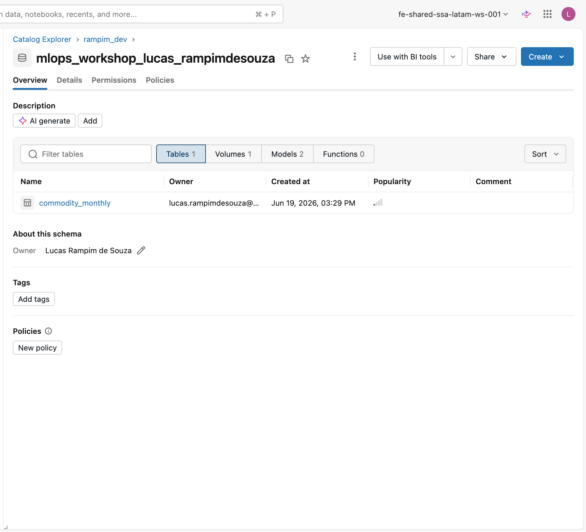

# Checklist do ambiente

Esta é a última parada antes dos notebooks. Aqui você confirma, em um só lugar, que os três passos anteriores deixaram tudo pronto para executar o caminho obrigatório, da geração do dataset até a verificação.

**Por que um checklist de ambiente?** Um checklist de ambiente é uma prática simples de MLOps: antes de executar um pipeline, você garante que os pré-requisitos de acesso, dados e configuração estão satisfeitos. Isso evita falhas no meio do caminho e torna a execução reproduzível para qualquer pessoa que repita o workshop.

## O que já deve estar pronto

| Passo | O que ficou pronto | Onde |
|-------|--------------------|------|
| Workspace | Acesso a um workspace com Unity Catalog e permissão para criar um schema | [Workspace Databricks](workspace.md) |
| Repositório e compute | Git folder clonada, `_config.py` com o seu `CATALOG` definido, compute escolhido | [Clonar o repositório](clone-repo.md) |
| Setup | O `00_setup.py` criou o schema, o volume e o experimento MLflow | [Configurar e rodar o setup](configure.md) |

## Confirme antes de começar

- O `00_setup.py` terminou imprimindo `Setup complete. Using <catálogo>.<schema>.`
- Você enxerga o schema e o volume `workshop_files` no Catalog Explorer.
- A constante `CATALOG` no `_config.py` aponta para um catálogo onde você tem permissão de criar schemas (o `SCHEMA` é derivado automaticamente do seu usuário).
- O compute escolhido (serverless, recomendado, ou cluster com Databricks Runtime ML) está ativo no seletor do notebook.

<figure markdown="span">
  
  <figcaption>O seu schema <code>mlops_workshop_&lt;seu-usuário&gt;</code> no Catalog Explorer, com o volume <code>workshop_files</code>. À medida que você avança nos labs, a tabela e os modelos vão aparecendo aqui.</figcaption>
</figure>

!!! warning "Atenção"
    Se o `00_setup.py` falhou com uma mensagem sobre o catálogo não existir, volte para [Configurar e rodar o setup](configure.md) e ajuste a constante `CATALOG` para um catálogo que já exista e ao qual você tenha acesso. Conferir privilégios: [Unity Catalog privileges](https://docs.databricks.com/en/data-governance/unity-catalog/manage-privileges/privileges.html) (documentação oficial).

!!! success "Pronto quando..."
    Todos os itens acima estão confirmados. O ambiente está preparado e reproduzível. Pode seguir para o primeiro lab.

No primeiro lab, você vai gerar o dataset sintético de preços de commodities que serve de base para todos os modelos do workshop.

**Próximo passo:** [Gerar o conjunto de dados](../lab-1-generate-data/index.md)
