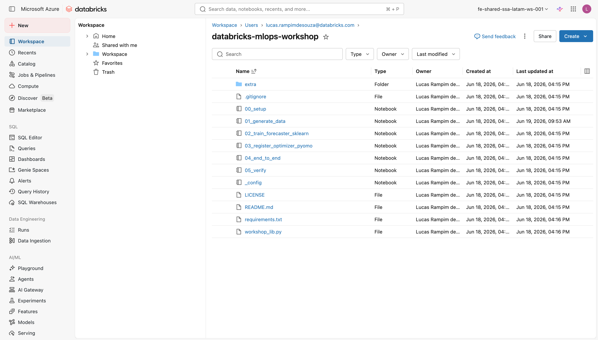

# Clonar o repositório

Com o workspace pronto (passo anterior), o objetivo agora é trazer o repositório para dentro dele. Os notebooks vivem no GitHub; para rodá-los na Databricks, você os clona como uma **Git folder** e escolhe o tipo de compute que vai usar durante o workshop.

!!! note "Conceito"
    Uma **Git folder** é um clone de um repositório Git que vive dentro do workspace da Databricks. Ela mantém a hierarquia de diretórios idêntica à do repositório remoto. Isso importa porque o `%run ./_config` usa um caminho relativo (`./`); se você importar os notebooks soltos, sem essa estrutura, a Databricks não consegue encontrar o arquivo e o comando falha. Documentação oficial: [Git folders (Repos)](https://docs.databricks.com/en/repos/index.html).

---

## 1. Clonar como Git folder

Siga os passos abaixo no seu workspace:

1. Copie a URL do repositório:

    ```text
    https://github.com/allexlima/databricks-mlops-workshop.git
    ```

2. Na barra lateral, clique em **Workspace**. Navegue até a pasta onde quer
   guardar o material, por exemplo, a sua pasta de usuário (`/Users/<seu-email>/`).

3. Clique em **Create** (ou no menu de contexto com o botão direito) e escolha
   **Git folder**.

4. Cole a URL no campo **Git repository URL**. O provedor (**GitHub**) e o nome
   sugerido para a pasta (`databricks-mlops-workshop`) são preenchidos
   automaticamente.

5. Mantenha a branch **`main`** selecionada, é onde ficam todos os notebooks do
   caminho obrigatório.

6. Clique em **Create Git folder**. A Databricks clona o repositório e abre a
   pasta. Você vai ver os notebooks `00_setup` até `05_verify` na raiz e a pasta
   `extra/` com os labs opcionais.

<figure markdown="span">
  
  <figcaption>Repositório clonado: os notebooks <code>00_setup</code> a <code>05_verify</code>, o <code>_config</code> e a pasta <code>extra/</code> no Workspace.</figcaption>
</figure>

!!! tip "Quer seguir a versão hands-on (mão na massa)?"
    O repositório tem duas branches:

    - **`main`** (selecionada acima): os notebooks completos, com todo o código
      pronto. Ideal para acompanhar a leitura ou usar como referência.
    - **`hands-on`**: os mesmos notebooks, mas com os blocos de código mais
      importantes substituídos por espaços reservados
      (`# Paste the code for "..." here`). Você preenche cada um copiando o bloco
      correspondente desta documentação, célula por célula.

    Para fazer o workshop no formato mão na massa, troque a branch da Git folder
    para `hands-on`: clique no nome da branch (ícone de Git) no topo da pasta
    clonada e selecione **`hands-on`**. Você pode alternar entre as duas a
    qualquer momento, sem precisar clonar de novo.

!!! tip "Curiosidade"
    Como o repositório é público, você não precisa configurar credenciais de Git
    para cloná-lo. Credenciais (um personal access token em **Settings › Linked
    accounts**) só são necessárias se você quiser dar `pull` em atualizações
    futuras ou trabalhar com um fork privado seu.

### Como o repositório está organizado

| Caminho | O que é |
|---------|---------|
| `_config.py` | Constante editável (`CATALOG`); `SCHEMA`, experimento, endpoint e nomes derivados do seu usuário; `SEED`, `R2_THRESHOLD` |
| `workshop_lib.py` | Funções compartilhadas (`generate_dataset`, `solve_purchase`, `PurchaseOptimizerModel`) |
| `00_setup.py` … `05_verify.py` | Caminho obrigatório, na ordem |
| `extra/` | Labs opcionais: PyTorch, serving e cleanup |
| `requirements.txt` | Dependências para clusters clássicos |

---

## 2. Escolher o compute

O workshop roda em dois tipos de compute. Escolha o seu cenário:

=== "Serverless (recomendado)"

    O compute serverless da Databricks isola as dependências de cada notebook
    via metadados PEP 723 embutidos no próprio arquivo `.py`. Cada notebook já
    declara o ML base environment (`databricks_ml_v5`, versão `5`), que inclui
    MLflow, scikit-learn, pandas e numpy pré-instalados. Extras específicos
    (Pyomo e HiGHS nos notebooks de otimização) são declarados ali e instalados
    automaticamente quando o notebook roda.

    **Você não precisa instalar nada.** Basta selecionar um serverless compute no
    seletor de cluster no topo do notebook e executar as células.

    Documentação oficial:
    [Serverless compute](https://docs.databricks.com/en/compute/serverless/index.html).

    !!! warning "Atenção"
        Se o compute serverless não aparecer no seletor do notebook, fale com o administrador do workspace ou crie uma conta gratuita na [Databricks Free Edition](https://www.databricks.com/learn/free-edition) (veja a página anterior).

    !!! note "Conceito"
        **PEP 723** é um padrão Python que permite declarar dependências de um
        script diretamente no cabeçalho do arquivo, em um bloco de metadados. A
        Databricks lê esse bloco antes de executar cada notebook serverless e
        monta um ambiente isolado com as libs declaradas. Notebooks clássicos
        ignoram esse bloco, por isso o procedimento de instalação é diferente.

=== "Cluster clássico"

    Em clusters clássicos (ML Runtime), o PEP 723 é ignorado. Você precisa
    instalar as dependências manualmente. Adicione as duas linhas abaixo como
    **primeira célula** de cada notebook antes de executar qualquer outro código:

    ```python
    %pip install -q -r requirements.txt   # a partir dos notebooks da raiz
    %restart_python
    ```

    Se estiver rodando os notebooks opcionais da pasta `extra/`, ajuste o
    caminho relativo:

    ```python
    %pip install -q -r ../requirements.txt
    %restart_python
    ```

    O `%restart_python` é obrigatório: ele reinicia o interpretador Python para
    que as libs recém-instaladas fiquem disponíveis na sessão atual.

    !!! warning "Atenção"
        Nunca pule o `%restart_python` após o `%pip install`. Sem ele, o Python
        continua usando a sessão anterior e as libs novas não são reconhecidas:
        o import vai falhar ou usar silenciosamente uma versão antiga.

---

**Próximo passo:** [Configurar e rodar o setup](configure.md)
