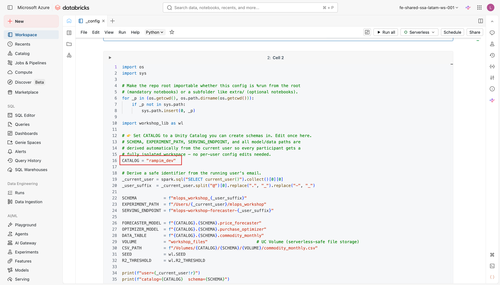
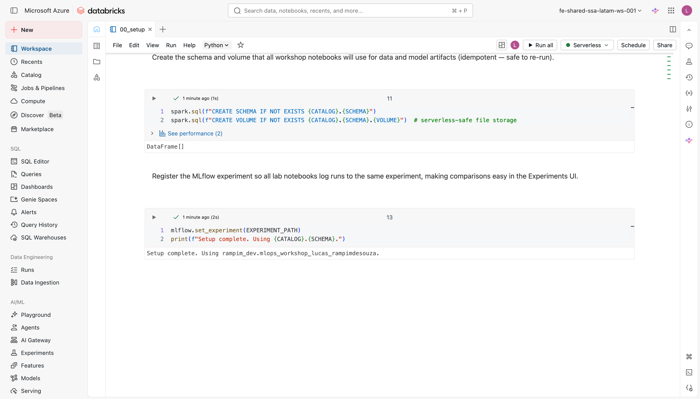

# Configurar e rodar o setup

Com o repositório clonado e o compute escolhido, o próximo passo é editar o `_config.py` e rodar o `00_setup.py`. São duas ações simples, feitas uma única vez; depois disso, todos os notebooks do workshop herdam a configuração automaticamente.

!!! warning "Atenção"
    Edite o `_config.py` **antes** de rodar o `00_setup.py`. Se você rodar o setup com os valores padrão e o catálogo `main` não existir ou não for acessível para você, o notebook vai interromper com uma mensagem de erro. Leva menos de um minuto ajustar o arquivo primeiro.

---

## 1. Editar o `_config.py`

O `_config.py` é o único arquivo que você precisa editar em todo o workshop — e nele você edita **apenas uma constante**, o `CATALOG`. Todos os notebooks herdam os valores via `%run ./_config`.

Abra o `_config.py` na raiz da Git folder e localize o bloco abaixo:

```python
# 👉 Set CATALOG to a Unity Catalog you can create schemas in. Edit once; every
# notebook picks it up via `%run ./_config`.
CATALOG = "main"
```

- **`CATALOG`**: nome do catálogo Unity Catalog onde o workshop vai criar seus objetos. O valor padrão é `main`. Troque pelo catálogo no qual você tem permissão de criar schemas. O catálogo precisa existir previamente; o `00_setup` verifica isso e exibe uma mensagem clara caso não o encontre.
- **`SCHEMA`, `EXPERIMENT_PATH`, `SERVING_ENDPOINT` e os nomes de modelos/dados**: você **não edita** nenhum deles. São **derivados automaticamente do seu usuário** (o `_config` lê `current_user()` e usa o seu e-mail como sufixo), dando a cada participante um **ambiente totalmente isolado** — schema, experimento e endpoint próprios, sem colisão e sem edição manual.

A partir do `CATALOG` e do seu usuário, o `_config.py` deriva automaticamente todos os demais nomes usados no workshop:

```python
# Sufixo seguro derivado do e-mail do usuário logado (ex.: ana.silva -> ana_silva)
_current_user = spark.sql("SELECT current_user()").collect()[0][0]
_user_suffix  = _current_user.split("@")[0].replace(".", "_").replace("-", "_")

SCHEMA           = f"mlops_workshop_{_user_suffix}"          # ex.: mlops_workshop_ana_silva
EXPERIMENT_PATH  = f"/Users/{_current_user}/mlops_workshop"  # experimento por-usuário
SERVING_ENDPOINT = f"mlops-workshop-forecaster-{_user_suffix}"
FORECASTER_MODEL = f"{CATALOG}.{SCHEMA}.price_forecaster"
OPTIMIZER_MODEL  = f"{CATALOG}.{SCHEMA}.purchase_optimizer"
DATA_TABLE       = f"{CATALOG}.{SCHEMA}.commodity_monthly"
VOLUME           = "workshop_files"
CSV_PATH         = f"/Volumes/{CATALOG}/{SCHEMA}/{VOLUME}/commodity_monthly.csv"
```

!!! note "Conceito"
    O padrão `catalog.schema.objeto` é a hierarquia de três níveis do Unity Catalog. `FORECASTER_MODEL` e `OPTIMIZER_MODEL` são os nomes completos dos dois modelos que você vai registrar nos labs seguintes: `price_forecaster` (scikit-learn) e `purchase_optimizer` (Pyomo PyFunc). `CSV_PATH` usa um caminho de UC Volume em vez de `/dbfs/` porque o DBFS FUSE não está disponível no compute serverless.

!!! tip "Curiosidade"
    Todos os artefatos de arquivo (datasets CSV etc.) vão para um **UC Volume** (`/Volumes/{catalog}/{schema}/workshop_files/`). Volumes são a forma correta e portável de armazenar arquivos na Databricks moderna: funcionam tanto em serverless quanto em clusters clássicos, e ficam sob a governança do Unity Catalog como qualquer outro objeto. Saiba mais: [MLflow no Databricks](https://docs.databricks.com/en/mlflow/index.html).

<figure markdown="span">
  
  <figcaption>A única linha que você edita: <code>CATALOG</code> (em destaque). <code>SCHEMA</code>, experimento, endpoint e nomes de modelos são derivados do seu usuário.</figcaption>
</figure>

!!! warning "Atenção"
    Não inclua o nome do catálogo em variáveis hardcoded em nenhuma célula de notebook; use sempre as constantes do `_config`. Isso garante que o workshop funcione em qualquer workspace sem edições espalhadas.

---

## 2. Rodar o `00_setup.py`

Com o `_config.py` configurado, abra o notebook `00_setup.py` e execute todas as células em ordem. O que ele faz, passo a passo:

1. **`%run ./_config`**: carrega todas as constantes do `_config.py` no escopo da sessão.
2. **`mlflow.set_registry_uri("databricks-uc")`**: aponta o MLflow para o Unity Catalog como registry, em vez do registry legado do workspace.
3. **Verifica que o catálogo existe**: executa `SHOW CATALOGS` e interrompe com uma mensagem clara se `CATALOG` não for encontrado. O `00_setup` nunca tenta criar o catálogo: isso requer privilégios de administrador e depende de configurações de storage que variam por workspace.
4. **Cria o schema e o volume**: `CREATE SCHEMA IF NOT EXISTS` e `CREATE VOLUME IF NOT EXISTS`, ambos idempotentes (seguro re-executar).
5. **Registra o experimento MLflow**: `mlflow.set_experiment(EXPERIMENT_PATH)` garante que todos os labs loguem runs no mesmo experimento, facilitando comparações na UI de Experiments.
6. **Imprime a confirmação final**: `Setup complete. Using <catalog>.<schema>.`

!!! warning "Atenção"
    Se o `assert` do catálogo falhar, a mensagem vai listar os catálogos disponíveis para você. Basta atualizar o `CATALOG` no `_config.py` para um catálogo da lista e re-executar o `00_setup`.

<figure markdown="span">
  
  <figcaption>O <code>00_setup.py</code> cria o schema e o volume e imprime a confirmação final <code>Setup complete. Using …</code></figcaption>
</figure>

!!! success "Pronto quando..."
    O `00_setup.py` imprime a linha:

    ```
    Setup complete. Using <catálogo>.<schema>.
    ```

    Isso confirma que o MLflow está apontado para o Unity Catalog, o schema e o volume existem, e o experimento foi registrado. Você está pronto para o checklist final.

---

**Próximo passo:** [Checklist do ambiente](checklist.md)
