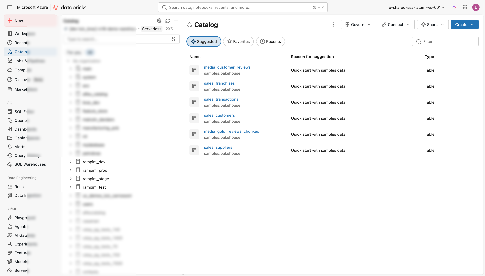
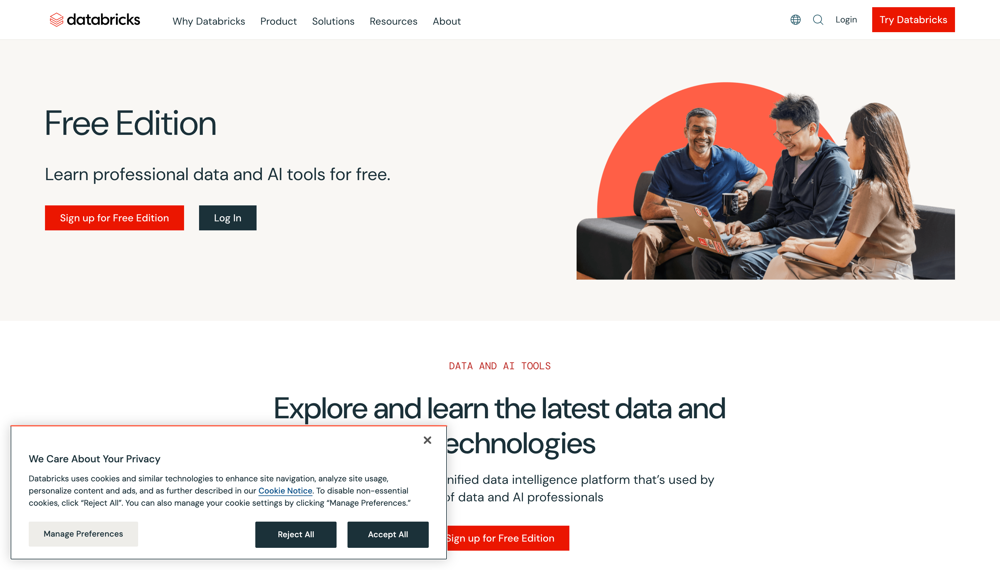

# Workspace Databricks

Para acompanhar este workshop, você precisa de um workspace Databricks com **Unity Catalog** habilitado. Há dois caminhos; escolha o que se encaixa melhor na sua situação.

---

## Opção A: seu próprio workspace

Se sua empresa já usa a Databricks, você provavelmente pode usar o workspace corporativo. Antes de começar, confirme dois pontos:

**Unity Catalog está habilitado?**
Abra o menu lateral e verifique se existe a seção *Catalog* com a árvore de catálogos, schemas e tabelas. Se você só vê a visão antiga de Data, o workspace ainda não migrou para Unity Catalog; fale com o administrador da Databricks.

**Você tem as permissões certas?**
O workshop usa um catálogo existente (padrão: `main`) e cria um schema dentro dele. Você precisará das seguintes permissões no Unity Catalog:

| Nível | Privilege | Para que serve |
|---|---|---|
| Catálogo | `USE CATALOG` | Acessar o catálogo |
| Catálogo | `CREATE SCHEMA` | Criar o schema do workshop |
| Schema | `CREATE TABLE` | Salvar os dados gerados |
| Schema | `CREATE MODEL` | Registrar os modelos no Unity Catalog |
| Schema | `CREATE VOLUME` | Criar o volume para armazenar arquivos |

!!! warning "Atenção"
    Se o catálogo `main` não for acessível para você (comum em workspaces corporativos com catálogos por time), não se preocupe. Você vai configurar isso na etapa seguinte.

**Unity Catalog** é a camada de governança centralizada da Databricks. Diferentemente do Hive Metastore legado (por workspace), o Unity Catalog é compartilhado entre workspaces e gerencia dados, modelos e volumes numa hierarquia de três níveis: `catalog.schema.objeto`. Neste workshop, os dois modelos treinados ficam registrados lá: `{catalog}.{schema}.price_forecaster` e `{catalog}.{schema}.purchase_optimizer`.

Consulte a [documentação oficial de privileges do Unity Catalog](https://docs.databricks.com/en/data-governance/unity-catalog/manage-privileges/privileges.html) se precisar solicitar as permissões ao seu administrador.

<figure markdown="span">
  
  <figcaption>O Catalog Explorer mostra a árvore de catálogos do Unity Catalog no menu lateral do workspace.</figcaption>
</figure>

---

## Opção B: Databricks Free Edition

Se você está fazendo o workshop por conta própria, ou simplesmente quer um ambiente limpo e isolado, a **Databricks Free Edition** é a opção ideal.

A Free Edition é uma conta gratuita da Databricks que já vem com:

- **Unity Catalog** habilitado e configurado por padrão
- **Serverless compute** incluído, sem precisar criar nem configurar cluster
- Um catálogo padrão pronto para usar

Para criar sua conta, acesse:
[**Databricks Free Edition**: databricks.com/learn/free-edition](https://www.databricks.com/learn/free-edition)

O cadastro leva alguns minutos. Após confirmar o e-mail, você terá acesso a um workspace funcional.

<figure markdown="span">
  
  <figcaption>A Databricks Free Edition: ambiente gratuito com Unity Catalog e serverless já habilitados.</figcaption>
</figure>

**Por que a Free Edition já vem com Unity Catalog?** O Unity Catalog foi lançado em 2022 e se tornou o padrão de governança da Databricks. A Free Edition o adota por padrão justamente porque ele é o caminho recomendado, inclusive para quem está começando. Workspaces antigos criados antes de 2023 podem ainda estar no Hive Metastore legado; a migração é possível mas precisa de permissões de administrador.

---

**Próximo passo:** [Clonar o repositório](clone-repo.md)
